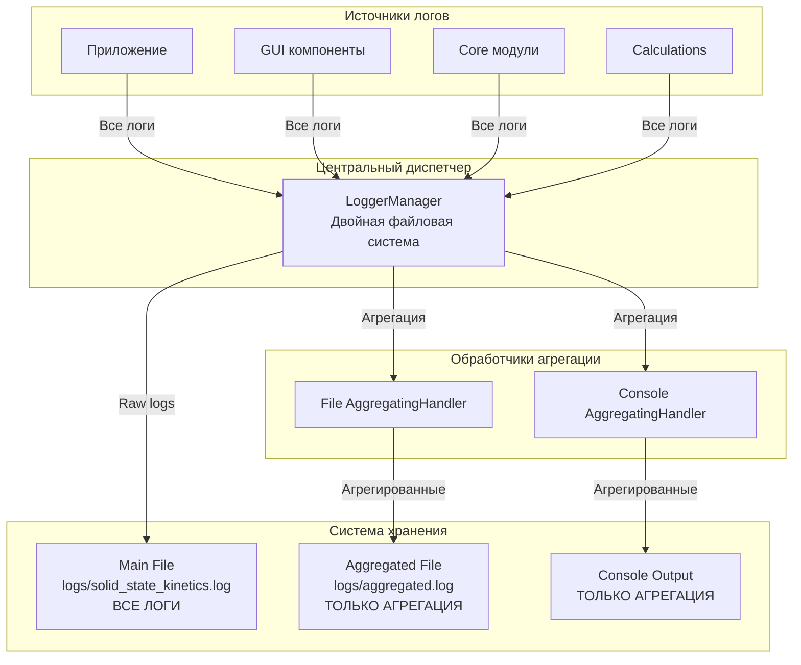

# Архитектура системы логирования для анализа кинетики твердофазных реакций

## Архитектурные принципы

### Основополагающие принципы (ЛОГГИНГ АРХИТЕКТУРНЫЙ МАНИФЕСТ)
- **Агрегация в реальном времени**: Интеллектуальное группирование связанных записей логов в структурированные сводки
- **Многоуровневая система файлов**: Раздельное сохранение полных и агрегированных логов с настраиваемой маршрутизацией
- **Табличное форматирование**: Автоматическое преобразование паттернов в читаемые ASCII-таблицы
- **Расширение контекста ошибок**: Детальный анализ ошибок с предшествующим контекстом операций
- **Каскадная агрегация операций**: Группировка связанных операций в цепочки для анализа производительности
- **Поточная безопасность**: Thread-safe обработка логов с минимальными блокировками
- **Конфигурируемые пресеты**: Готовые конфигурации для разных сценариев использования

---

## Общая архитектура системы логирования

Система построена на **многоэтапной агрегации логов** с **реальным временем обработки** и **интеллектуальным паттерн детектированием**, обеспечивающей снижение объема логов при сохранении критической информации.

### Центральная система управления логированием

**LoggerManager** (`src/core/logger_config.py:9-381`) - централизованный менеджер конфигурации:
- **Двойная файловая система**: основной файл (все логи) + агрегированный файл (только сводки)
- **Консольная агрегация**: только агрегированные логи выводятся в консоль
- **Динамическое управление**: runtime переключение компонентов агрегации
- **Статистика производительности**: детальные метрики агрегации и компрессии

### Архитектура системы файлов логирования



### Пятиэтапная архитектура агрегации

**Этап 1: Буферизация** - `BufferManager` (`src/log_aggregator/buffer_manager.py`)
- Временное хранение логов с автоматической очисткой
- Size-based и time-based стратегии флуша
- Thread-safe операции с блокировками

**Этап 2: Детектирование паттернов** - `PatternDetector` (`src/log_aggregator/pattern_detector.py`)
- Обнаружение повторяющихся сообщений
- Группировка по временным окнам
- Similarity threshold для гибкого матчинга

**Этап 3: Табличное форматирование** - `TabularFormatter` (`src/log_aggregator/tabular_formatter.py`)
- ASCII-таблицы с адаптивными ширинами колонок
- Специализированные форматы для разных типов операций
- Статистические сводки с эмодзи-индикаторами

**Этап 4: Расширение ошибок** - `ErrorExpansionEngine` (`src/log_aggregator/error_expansion.py`)
- Детальный анализ контекста ошибок
- Трассировка связанных операций
- Предложения по исправлению

**Этап 5: Агрегация операций и значений** - `OperationAggregator` + `ValueAggregator`
- Каскадное группирование связанных операций
- Компрессия повторяющихся обновлений значений
- Метрики производительности операций

---

## Архитектура компонентов агрегации

### Центральный обработчик реального времени

**AggregatingHandler** (`src/log_aggregator/realtime_handler.py:29-417`) - основной обработчик:

**Структура компонентов**:
```python
# Инициализация всех агрегационных компонентов
self.buffer_manager = BufferManager(max_size=config.buffer_size, flush_interval=config.flush_interval)
self.pattern_detector = PatternDetector(similarity_threshold=config.pattern_similarity_threshold)
self.aggregation_engine = AggregationEngine(min_pattern_entries=config.min_pattern_entries)
self.tabular_formatter = TabularFormatter(config=tabular_config)
self.error_expansion_engine = ErrorExpansionEngine(config=error_config)
self.operation_aggregator = OperationAggregator(config=operation_config)
self.value_aggregator = ValueAggregator(config=value_config)
```

**Поток обработки логов**:
1. `emit(record)` - получение исходного лога
2. `BufferManager.add_record()` - буферизация с временными метками
3. `PatternDetector.detect_patterns()` - поиск повторяющихся паттернов
4. `AggregationEngine.aggregate()` - создание агрегированных записей
5. `TabularFormatter.format_patterns_as_tables()` - преобразование в таблицы
6. `target_handler.emit()` - вывод в консоль/файл

### Система детектирования паттернов

**PatternDetector** (`src/log_aggregator/pattern_detector.py`) - интеллектуальный анализ:

**Типы паттернов**:
- **LogPattern**: Простые повторяющиеся сообщения
- **PatternGroup**: Сложные группы связанных операций
- **Временные окна**: Группировка по временным интервалам
- **Similarity matching**: Гибкое сравнение с порогом схожести

**Специализированные детекторы**:
```python
# Паттерны операций
"plot_lines_addition"              # Добавление линий на график
"cascade_component_initialization" # Инициализация компонентов
"request_response_cycle"           # Циклы запрос-ответ
"file_operations"                  # Файловые операции
"gui_updates"                      # Обновления GUI
```

### Система табличного форматирования

**TabularFormatter** (`src/log_aggregator/tabular_formatter.py:38-582`) - ASCII таблицы:

**Специализированные форматировщики**:

**Plot Lines Table** - таблица добавления кинетических моделей:
```
┌──────────────────────────────────────────────────────┐
│ 📊 Plot Lines Addition Summary                        │
├──────────────────────────────────────────────────────┤
│ # │ Line Name │ Time     │ Duration (ms) │ Status    │
├───┼───────────┼──────────┼───────────────┼───────────┤
│ 1 │ F1/3      │ +0.0ms   │ 0.0           │ ✅ Success │
│ 2 │ F3/4      │ +197.8ms │ 197.8         │ ✅ Success │
│ 3 │ F3/2      │ +355.3ms │ 355.3         │ ✅ Success │
└──────────────────────────────────────────────────────┘
📊 Total: 3 kinetic model lines added in 355.3ms (avg: 118.4ms per line)
```

**Request-Response Table** - циклы операций:
```
┌─────────────────────────────────────────────────────────┐
│ 🔄 Request-Response Cycles                              │
├─────────────────────────────────────────────────────────┤
│ # │ Operation     │ Time      │ Duration (ms) │ Status  │
├───┼───────────────┼───────────┼───────────────┼─────────┤
│ 1 │ UPDATE_VALUE  │ 13:13:22  │ 15.3          │ ✅ Complete │
│ 2 │ GET_DF_DATA   │ 13:13:22  │ 8.7           │ ✅ Complete │
│ 3 │ SET_VALUE     │ 13:13:22  │ 12.1          │ ⏳ Pending │
└─────────────────────────────────────────────────────────┘
📊 Request-Response cycles: 3 operations, avg: 12.0ms
```

**Адаптивные ширины колонок**:
- Автоматический расчет на основе содержимого
- Пропорциональное сжатие при превышении максимальной ширины
- Минимальные ширины для читаемости

### Система агрегации операций

**OperationAggregator** (`src/log_aggregator/operation_aggregator.py:94-331`) - каскадное группирование:

**OperationGroup структура**:
```python
@dataclass
class OperationGroup:
    root_operation: str              # Инициирующая операция
    start_time: datetime            # Начало каскада
    end_time: datetime              # Завершение каскада
    operation_count: int            # Количество операций
    actors: Set[str]                # Участвующие модули
    operations: List[str]           # Хронологический список операций
    has_errors: bool                # Наличие ошибок
    has_warnings: bool              # Наличие предупреждений
    records: List[BufferedLogRecord] # Все записи для контекста
```

**Корневые операции каскадов**:
```python
root_operations = {
    "ADD_REACTION", "REMOVE_REACTION",           # Управление реакциями
    "MODEL_BASED_CALCULATION",                  # Model-based расчеты
    "DECONVOLUTION",                           # Деконволюция пиков
    "MODEL_FIT_CALCULATION",                   # Model-fit анализ
    "MODEL_FREE_CALCULATION",                  # Model-free анализ
    "LOAD_FILE", "TO_DTG",                     # Файловые операции
    "SMOOTH_DATA", "SUBTRACT_BACKGROUND",      # Предобработка данных
    "GET_DF_DATA", "UPDATE_VALUE", "SET_VALUE" # Операции с данными
}
```

**Агрегированные записи операций**:
```
🔄 OPERATION CASCADE: DECONVOLUTION | ⏱️ 2.341s | 📊 7 operations | 
🎭 Actors: calculations, file_data, calculation_data | ✅ SUCCESS
```

### Система расширения ошибок

**ErrorExpansionEngine** (`src/log_aggregator/error_expansion.py`) - детальный анализ:

**Расширенный анализ ошибок**:
```
================================================================================
🚨 DETAILED ERROR ANALYSIS - ERROR
================================================================================
📍 Location: realtime_handler.py:166
⏰ Time: 2025-06-13 13:13:35
💬 Message: Error in AggregatingHandler.emit: not all arguments converted during string formatting

📋 PRECEDING CONTEXT:
----------------------------------------
  1. [DEBUG] Expanded error: Error in AggregatingHandler.emit (0.0s ago)
  2. [DEBUG] Processed 7 records, found 2 patterns (0.0s ago)
  3. [DEBUG] Processed 6 records, found 3 patterns (0.0s ago)

🔗 RELATED OPERATIONS:
----------------------------------------
  1. [DEBUG] realtime_handler.py:190 - Expanded error: Error in AggregatingHandler.emit
  2. [ERROR] realtime_handler.py:166 - Error in AggregatingHandler.emit

💡 SUGGESTED ACTIONS:
----------------------------------------
  1. Check code in file realtime_handler.py:166
================================================================================
```

**Конфигурация расширения**:
- `context_lines: 5` - количество предшествующих строк контекста
- `context_time_window: 10.0s` - временное окно поиска связанных операций
- `trace_depth: 10` - максимальная глубина трассировки операций
- `error_threshold_level: WARNING` - минимальный уровень для расширения

---

## Конфигурационная архитектура

### Иерархическая система конфигурации

**AggregationConfig** (`src/log_aggregator/config.py:95-418`) - главная конфигурация:

**Компонентные конфигурации**:
```python
@dataclass
class AggregationConfig:
    enabled: bool = True
    buffer_size: int = 100
    flush_interval: float = 5.0
    pattern_similarity_threshold: float = 0.8
    min_pattern_entries: int = 2
    
    # Компонентные конфигурации
    error_expansion: ErrorExpansionConfig
    tabular_formatting: TabularFormattingConfig  
    operation_aggregation: OperationAggregationConfig
    value_aggregation: ValueAggregationConfig
```

**Готовые пресеты конфигурации**:
- `minimal` - минимальная агрегация для отладки
- `performance` - оптимизация производительности
- `detailed` - максимальная детализация для анализа

### Runtime управление конфигурацией

**Динамическое переключение** через LoggerManager:
```python
# Переключение компонентов
LoggerManager.toggle_aggregation(enabled=True)
LoggerManager.toggle_error_expansion(enabled=True) 
LoggerManager.toggle_tabular_format(enabled=True)
LoggerManager.toggle_operation_aggregation(enabled=True)
LoggerManager.toggle_value_aggregation(enabled=True)

# Обновление конфигурации
LoggerManager.update_aggregation_config({
    "buffer_size": 200,
    "flush_interval": 3.0,
    "operation_aggregation": {
        "cascade_window": 2.0,
        "min_cascade_size": 5
    }
})

# Получение статистики
stats = LoggerManager.get_aggregation_stats()
# {
#     "total_stats": {
#         "total_records": 1250,
#         "aggregated_records": 89,
#         "compression_ratio": 0.93,
#         "operation_cascades_aggregated": 23,
#         "tables_generated": 12,
#         "errors_expanded": 3
#     }
# }
```

---

## Потоки обработки данных

### Жизненный цикл лога

**Полный поток агрегации логов**:
1. **Инициация** - модуль приложения создает лог-запись
2. **Буферизация** - BufferManager добавляет в буфер с timestamp
3. **Паттерн детектирование** - PatternDetector анализирует схожие записи
4. **Агрегация** - AggregationEngine группирует связанные паттерны
5. **Табличное форматирование** - TabularFormatter создает ASCII таблицы
6. **Расширение ошибок** - ErrorExpansionEngine анализирует ошибки с контекстом
7. **Операционная агрегация** - OperationAggregator группирует каскады операций
8. **Компрессия значений** - ValueAggregator сжимает повторяющиеся обновления
9. **Маршрутизация вывода** - направление в консоль/файлы согласно конфигурации

### Система безопасного получения сообщений

**SafeMessageUtils** (`src/log_aggregator/safe_message_utils.py`) - обработка ошибок форматирования:

**Безопасное извлечение сообщений**:
```python
def safe_get_message(record: logging.LogRecord) -> str:
    """Безопасное получение сообщения с обработкой ошибок форматирования."""
    try:
        return record.getMessage()
    except (TypeError, ValueError) as e:
        # Обработка ошибок старого форматирования строк
        msg = getattr(record, "msg", "Unknown message")
        args = getattr(record, "args", ())
        
        if isinstance(msg, str) and "%" in msg and args:
            safe_msg = msg.replace("%", "%%")  # Экранирование %
            try:
                return safe_msg % args
            except:
                return f"{msg} (args: {args})"
        return str(msg)
    except Exception:
        return f"[Message formatting error: {type(e).__name__}: {e}]"
```

### Метрики производительности и статистика

**Статистика агрегации**:
- `total_records` - общее количество обработанных записей
- `aggregated_records` - количество агрегированных записей  
- `compression_ratio` - коэффициент сжатия логов (1 - aggregated/total)
- `patterns_detected` - количество обнаруженных паттернов
- `tables_generated` - количество созданных таблиц
- `errors_expanded` - количество расширенных ошибок
- `operation_cascades_aggregated` - количество агрегированных каскадов операций
- `buffer_flushes` - количество сбросов буфера

**Производительность системы**:
- Thread-safe операции с минимальными блокировками
- Асинхронная обработка через буферизацию
- Настраиваемые временные окна для группировки
- Адаптивные алгоритмы детектирования паттернов

---

## Интеграция с основной системой

### Инициализация на уровне модуля

**Автоматическая конфигурация** (`src/core/logger_config.py:377-385`):
```python
# Инициализация при импорте модуля с включенной агрегацией
LoggerManager.configure_logging(
    enable_aggregation=True,
    aggregation_preset="performance",
    enable_error_expansion=True,
    enable_tabular_format=True,
    enable_operation_aggregation=True,
    enable_value_aggregation=True,
)
```

### Интеграция с существующим кодом

**Бесшовная интеграция** - без изменения существующего кода:
```python
# Существующий код остается неизменным
logger = LoggerManager.get_logger(__name__)
logger.info("Processing deconvolution for %s", filename)
logger.debug("Adding reaction %d with function %s", reaction_id, function_type)

# Система автоматически:
# 1. Группирует схожие сообщения
# 2. Создает таблицы для операций
# 3. Расширяет ошибки с контекстом
# 4. Агрегирует каскады операций
```

### Система двух файлов логирования

**Файловая архитектура**:
- **logs/solid_state_kinetics.log** - ВСЕ логи (сырые + агрегированные)
- **logs/aggregated.log** - ТОЛЬКО агрегированные логи и таблицы
- **Console output** - ТОЛЬКО агрегированные логи (дублирует aggregated.log)

**Маршрутизация логов**:
```python
# Исходные логи идут в main file
raw_logger.info("Starting deconvolution...")        # → main file
raw_logger.debug("Processing reaction 1...")        # → main file

# Агрегированные логи идут в оба файла + консоль
aggregated_table = "📊 Plot Lines Addition..."      # → aggregated file + console
operation_cascade = "🔄 OPERATION CASCADE..."       # → aggregated file + console
error_expansion = "🚨 DETAILED ERROR ANALYSIS..."   # → aggregated file + console
```

---

## Ключевые архитектурные преимущества

### Интеллектуальная агрегация
1. **Снижение объема логов**: компрессия до 90%+ при сохранении критической информации
2. **Структурированная визуализация**: таблицы вместо длинных списков
3. **Контекстный анализ**: расширение ошибок с предшествующими операциями
4. **Каскадное группирование**: объединение связанных операций в логические группы

### Производительность и надежность
1. **Thread-safe архитектура**: безопасная многопоточная обработка
2. **Неблокирующая агрегация**: минимальное влияние на производительность приложения
3. **Буферизованная обработка**: сглаживание пиков нагрузки
4. **Отказоустойчивость**: graceful degradation при ошибках агрегации

### Гибкость и расширяемость
1. **Модульная архитектура**: независимые компоненты агрегации
2. **Конфигурируемые пресеты**: готовые настройки для разных сценариев
3. **Runtime управление**: динамическое переключение без перезапуска
4. **Расширяемые паттерны**: легкое добавление новых типов агрегации

### Интеграция с рабочими процессами
1. **Научный анализ**: специализированные таблицы для кинетических данных
2. **Отладка приложения**: детальный контекст ошибок с трассировкой операций
3. **Мониторинг производительности**: метрики каскадов операций и времени выполнения
4. **Пользовательский интерфейс**: агрегированные логи для консольного вывода

Архитектура логирования обеспечивает полный жизненный цикл обработки логов от простых записей до структурированных аналитических сводок с высокой производительностью, надежностью и удобством использования для научных расчетов кинетики твердофазных реакций.
