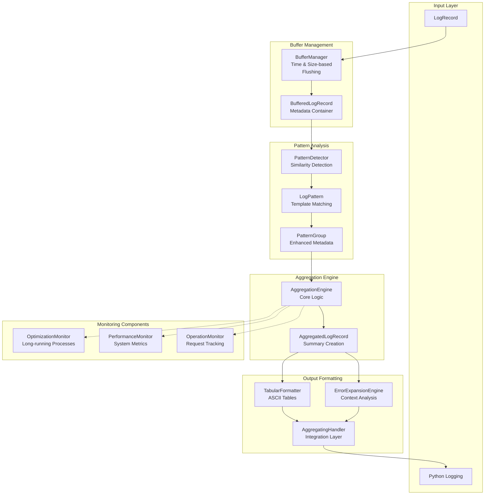

# Log Aggregation Architecture for solid-state-kinetics

## Architectural Principles

### Foundational Principles (LOG AGGREGATION ARCHITECTURAL MANIFEST)
- **Real-time Processing**: Continuous log aggregation with minimal latency through buffering mechanisms
- **Pattern-driven Aggregation**: Intelligent detection and grouping of similar log messages to reduce noise
- **Multi-stage Processing Pipeline**: Hierarchical processing through buffer → pattern detection → aggregation → formatting
- **Adaptive Monitoring**: Context-aware monitoring for optimization processes, performance metrics, and operation tracking
- **Error Context Expansion**: Comprehensive error analysis with actionable recommendations and root cause investigation
- **Thread-safe Operations**: Concurrent access support for multi-threaded application environments
- **Modular Component Design**: Loosely coupled components with clear interfaces for extensibility

---

## Overall Log Aggregation System Architecture

The log aggregation system implements a **real-time stream processing architecture** with PyQt6 integration, providing **intelligent log analysis** and **structured output formatting** for scientific computation monitoring.

### Central Processing Pipeline

The system processes logs through a **5-stage pipeline** with parallel monitoring capabilities:



### Integration Points

**Python Logging System Integration** (`src/log_aggregator/realtime_handler.py:20-509`):
- `AggregatingHandler` extends `logging.Handler` for seamless integration
- Compatible with existing `LoggerManager` infrastructure
- Optional activation through configuration parameters
- Pass-through capability for non-aggregated logging

**Configuration-driven Activation**:
```python
LoggerManager.configure_logging(
    enable_aggregation=True,
    aggregation_config={"buffer_size": 50, "flush_interval": 3.0}
)
```

---

## Core Component Architecture

### Buffer Management System

**BufferManager** (`src/log_aggregator/buffer_manager.py:30-170`) - **thread-safe log record buffering**:

**Container Structure**:
- `BufferedLogRecord` - Enhanced `LogRecord` with metadata and timestamps
- `collections.deque` - Thread-safe circular buffer implementation
- Automatic processing state tracking

**Flushing Mechanisms**:
- **Size-based**: Configurable `max_size` threshold (default: 100 records)
- **Time-based**: Configurable `flush_interval` (default: 5.0 seconds)
- **Manual flushing**: On-demand processing trigger
- **Thread-safe operations**: `threading.Lock` for concurrent access

**Key Features**:
```python
class BufferManager:
    def __init__(self, max_size: int = 100, flush_interval: float = 5.0)
    def add_record(self, record: logging.LogRecord) -> None  # Thread-safe addition
    def get_pending_records(self) -> List[BufferedLogRecord]  # Flush trigger
    def should_flush(self) -> bool  # Automatic flushing logic
```

### Pattern Detection System

**PatternDetector** (`src/log_aggregator/pattern_detector.py:80-478`) - **intelligent similarity analysis**:

**Pattern Types** (`src/log_aggregator/pattern_detector.py:18-25`):
- `plot_lines_addition` - Graphics rendering operations
- `cascade_component_initialization` - Component startup sequences  
- `request_response_cycle` - Inter-component communication
- `file_operations` - Data loading and file I/O
- `gui_updates` - User interface modifications
- `basic_similarity` - General similarity matching (fallback)

**Detection Algorithms**:
- **Difflib similarity**: Configurable threshold-based matching
- **Template extraction**: Variable placeholder identification
- **Temporal grouping**: Time-window based pattern clustering
- **Message normalization**: Safe message extraction with error handling

**Pattern Structures**:
```python
@dataclass
class LogPattern:
    pattern_id: str          # Unique pattern identifier
    template: str           # Message template with placeholders
    records: List[BufferedLogRecord]  # Matching log records
    count: int             # Pattern occurrence frequency
    pattern_type: str      # Classification type
    first_seen: float     # Initial detection timestamp
    last_seen: float      # Latest occurrence timestamp
```

### Aggregation Processing Engine

**AggregationEngine** (`src/log_aggregator/aggregation_engine.py:70-511`) - **pattern aggregation with monitoring**:

**Core Aggregation Logic**:
- **Minimum threshold enforcement**: Configurable `min_pattern_entries`
- **Time span calculation**: Duration between first and last occurrences
- **Sample message extraction**: Representative message selection
- **Statistical summarization**: Count, frequency, and temporal metrics

**Enhanced Monitoring Integration**:
- **OptimizationMonitor**: Long-running calculation tracking
- **PerformanceMonitor**: System resource and processing metrics
- **OperationMonitor**: Request-response cycle analysis

**Output Structure**:
```python
@dataclass
class AggregatedLogRecord:
    pattern_id: str
    template: str
    count: int
    level: str
    logger_name: str
    first_timestamp: datetime
    last_timestamp: datetime
    sample_messages: List[str]
    
    def to_log_message(self) -> str  # Formatted output
    def to_dict(self) -> Dict[str, Any]  # Structured data
```

---

## Advanced Analysis Components

### Error Context Expansion Engine

**ErrorExpansionEngine** (`src/log_aggregator/error_expansion.py:90-557`) - **comprehensive error analysis**:

**Error Classification System**:
- **Automated pattern matching**: Keyword-based error categorization
- **Context analysis**: Preceding and following log record examination
- **Root cause investigation**: Operation trace analysis
- **Actionable recommendations**: AI-generated resolution suggestions

**Error Categories** (`src/log_aggregator/error_expansion.py:70-90`):
- `file_not_found` - File system and path issues
- `memory_error` - Resource allocation problems
- `optimization_failure` - Scientific calculation failures
- `gui_error` - User interface exceptions
- `communication_error` - Inter-component failures

**Context Structure**:
```python
@dataclass
class ErrorContext:
    error_record: BufferedLogRecord
    preceding_records: List[BufferedLogRecord]
    following_records: List[BufferedLogRecord]
    related_operations: List[BufferedLogRecord]
    error_trace: Optional[str]
    suggested_actions: List[str]
    error_classification: Optional[str]
    context_keywords: List[str]
```

**Analysis Features**:
- **Temporal context window**: Configurable time range for related record analysis
- **Operation correlation**: Linking errors to specific operations
- **Stack trace extraction**: Automatic traceback parsing
- **Adaptive thresholds**: Load-based error expansion control

### Tabular Output Formatting

**TabularFormatter** (`src/log_aggregator/tabular_formatter.py:50-585`) - **structured ASCII table generation**:

**Adaptive Table Generation**:
- **Column width optimization**: Dynamic sizing based on content
- **Pattern-specific formatting**: Specialized layouts for different pattern types
- **Summary statistics**: Aggregated metrics and insights
- **Unicode-safe rendering**: Proper handling of special characters

**Table Types**:
- **Pattern summaries**: Aggregated pattern occurrence tables
- **Optimization progress**: Real-time calculation status tables
- **Error analysis**: Structured error context presentation
- **Performance metrics**: System resource utilization tables

**Configuration Options**:
```python
@dataclass
class TabularFormattingConfig:
    enabled: bool = True
    max_column_width: int = 50
    show_timestamps: bool = True
    show_loggers: bool = True
    compact_mode: bool = False
    table_borders: bool = True
```

---

## Specialized Monitoring Systems

### Optimization Process Monitoring

**OptimizationMonitor** (`src/log_aggregator/optimization_monitor.py:50-467`) - **long-running calculation tracking**:

**Process Status Tracking**:
```python
class OptimizationStatus(Enum):
    STARTING = "starting"
    RUNNING = "running"
    CONVERGING = "converging"
    STUCK = "stuck"
    COMPLETED = "completed"
    FAILED = "failed"
    CANCELLED = "cancelled"
```

**Metrics Collection**:
- **Iteration tracking**: Current vs. maximum iterations
- **Convergence analysis**: Progress rate and stagnation detection
- **Resource monitoring**: Memory usage and CPU utilization
- **Time estimation**: Completion time prediction

**Scientific Calculation Support**:
- **Deconvolution monitoring**: Peak fitting optimization progress
- **Model-based analysis**: Multi-reaction scheme optimization
- **Series analysis**: Batch processing status
- **Error propagation**: Optimization failure analysis

### Performance Metrics System

**PerformanceMonitor** (`src/log_aggregator/performance_monitor.py`) - **system resource tracking**:

**Metrics Categories**:
- **Processing latency**: Log processing time measurements
- **Memory utilization**: Buffer and cache memory tracking
- **Throughput analysis**: Records processed per second
- **Resource bottlenecks**: System constraint identification

**Adaptive Behavior**:
- **Load-based throttling**: Automatic aggregation adjustment
- **Memory pressure handling**: Buffer size optimization
- **Performance alerting**: Threshold-based notifications

### Operation Lifecycle Monitoring

**OperationMonitor** (`src/log_aggregator/operation_monitor.py`) - **request-response cycle tracking**:

**Operation Tracking**:
- **Request correlation**: Matching requests to responses
- **Latency measurement**: End-to-end operation timing
- **Success rate monitoring**: Operation completion statistics
- **Error correlation**: Linking failures to specific operations

**Integration with Core Components**:
- **BaseSignals integration**: Automatic operation detection
- **Path-keys correlation**: Data operation tracking
- **GUI interaction monitoring**: User action consequence tracking

---

## Configuration and Integration Architecture

### Hierarchical Configuration System

**AggregationConfig** (`src/log_aggregator/config.py:1-607`) - **comprehensive configuration management**:

**Core Configuration Categories**:
```python
@dataclass
class AggregationConfig:
    # Buffer management
    buffer_size: int = 100
    flush_interval: float = 5.0
    
    # Pattern detection
    pattern_similarity_threshold: float = 0.8
    min_pattern_entries: int = 2
    
    # Error expansion
    error_expansion_enabled: bool = True
    error_threshold_level: str = "ERROR"
    error_context_lines: int = 3
    error_trace_depth: int = 10
    
    # Tabular formatting
    tabular_formatting_enabled: bool = True
    
    # Performance tuning
    enable_optimization_monitoring: bool = True
    enable_performance_monitoring: bool = True
    enable_operation_monitoring: bool = True
```

**Specialized Configurations**:
- **ErrorExpansionConfig**: Error analysis parameters
- **TabularFormattingConfig**: Table generation settings
- **OptimizationMonitoringConfig**: Long-running process settings
- **PerformanceMonitoringConfig**: System metrics parameters

### Safe Message Processing

**SafeMessageUtils** (`src/log_aggregator/safe_message_utils.py`) - **robust message handling**:

**Error-resistant Processing**:
- **Exception handling**: Graceful degradation for malformed records
- **Message normalization**: Consistent formatting across components
- **Encoding safety**: Unicode and special character handling
- **Comparison utilities**: Safe string comparison for pattern matching

---

## Data Flow and Processing Pipeline

### Real-time Processing Workflow

**Stage 1: Log Record Ingestion**
1. **Python logging event** → `AggregatingHandler.emit()`
2. **Record validation** → Safe message extraction
3. **Buffer addition** → `BufferManager.add_record()`
4. **Threshold checking** → Time/size-based flush triggers

**Stage 2: Pattern Detection**
1. **Buffered records retrieval** → `BufferManager.get_pending_records()`
2. **Similarity analysis** → `PatternDetector.detect_patterns()`
3. **Template extraction** → Variable placeholder identification
4. **Pattern classification** → Type-specific categorization

**Stage 3: Aggregation Processing**
1. **Pattern validation** → Minimum entry threshold enforcement
2. **Statistical aggregation** → Count, timing, and sample generation
3. **Monitoring integration** → Performance and optimization tracking
4. **Record creation** → `AggregatedLogRecord` generation

**Stage 4: Context Enhancement**
1. **Error detection** → Log level and keyword analysis
2. **Context expansion** → `ErrorExpansionEngine.expand_error()`
3. **Recommendation generation** → Actionable suggestion creation
4. **Correlation analysis** → Operation and temporal linking

**Stage 5: Output Formatting**
1. **Format selection** → Tabular vs. linear output decision
2. **Table generation** → `TabularFormatter.format_pattern()`
3. **Final output** → Target handler forwarding
4. **Logging integration** → Standard logging system output

### Monitoring Data Flows

**Optimization Process Flow**:
1. **Process detection** → Operation type identification
2. **Metrics initialization** → `OptimizationMetrics` creation
3. **Progress tracking** → Iteration and convergence monitoring
4. **Status updates** → Real-time status broadcasting
5. **Completion analysis** → Success/failure determination

**Performance Monitoring Flow**:
1. **Resource sampling** → CPU, memory, and I/O measurement
2. **Latency tracking** → Processing time analysis
3. **Throughput calculation** → Records per second metrics
4. **Bottleneck detection** → System constraint identification
5. **Adaptive adjustment** → Configuration optimization

---

## Integration with Core Application

### LoggerManager Integration

**Seamless Integration Points**:
- **Optional activation**: Feature flag-based enabling
- **Configuration inheritance**: LoggerManager settings propagation
- **Handler chaining**: Existing logging infrastructure preservation
- **Performance impact**: Minimal overhead when disabled

**Configuration Integration**:
```python
# In LoggerManager.configure_logging()
if enable_aggregation:
    aggregating_handler = AggregatingHandler(
        target_handler=existing_handler,
        config=aggregation_config
    )
    logger.addHandler(aggregating_handler)
```

### Scientific Workflow Integration

**Domain-specific Pattern Recognition**:
- **Deconvolution operations**: Peak fitting progress tracking
- **Model-based calculations**: Multi-reaction optimization monitoring
- **Series analysis**: Batch processing status
- **GUI interactions**: User workflow tracking

**Kinetica Domain Integration**:
- **Reaction parameter updates**: Path-keys based operation tracking
- **Optimization convergence**: Scientific algorithm monitoring
- **Data loading operations**: File I/O pattern recognition
- **Error correlation**: Scientific calculation failure analysis

---

## Architectural Advantages

### Scalability and Performance
1. **Streaming processing**: Real-time log analysis without blocking
2. **Memory efficiency**: Bounded buffer sizes with automatic flushing
3. **Adaptive thresholds**: Load-based configuration adjustment
4. **Parallel processing**: Thread-safe components for concurrent access

### Maintainability and Extensibility
1. **Modular design**: Independent component development and testing
2. **Configuration-driven behavior**: Runtime customization without code changes
3. **Pattern extensibility**: Easy addition of new pattern types
4. **Monitoring expansion**: Pluggable monitoring component architecture

### Scientific Computing Focus
1. **Domain-aware patterns**: Scientific calculation-specific pattern recognition
2. **Optimization monitoring**: Long-running process tracking
3. **Error context analysis**: Comprehensive failure investigation
4. **Performance optimization**: Resource-conscious design for compute-intensive applications

### Development and Debugging Support
1. **Comprehensive error expansion**: Detailed failure analysis with recommendations
2. **Operation correlation**: Request-response lifecycle tracking
3. **Performance insights**: System bottleneck identification
4. **Structured output**: Machine-readable and human-friendly formats

The log aggregation architecture provides a comprehensive, intelligent logging infrastructure specifically designed for scientific computing applications, offering real-time insights, performance monitoring, and detailed error analysis while maintaining minimal overhead and seamless integration with existing systems.
