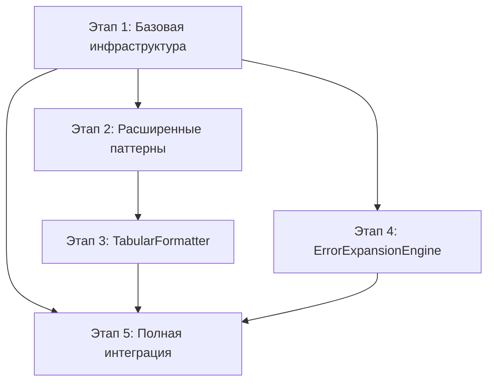

# План разработки модуля агрегации логов - Обзор этапов

Техническое задание для модуля агрегации логов в реальном времени разделено на **5 этапов**, каждый из которых завершается отдельным пул-реквестом.

## Общая архитектура
Модуль создает систему агрегации логов в реальном времени с двумя ключевыми компонентами:
- **TabularFormatter** - табличное представление агрегированных данных  
- **ErrorExpansionEngine** - детальный анализ ошибок с контекстом

## Этапы разработки

### 🏗️ [Этап 1: Базовая инфраструктура](stage_1_base_infrastructure.md)
**Статус:** Готов к реализации  
**Цель:** Создание основной архитектуры и базовых компонентов  
**Компоненты:** AggregatingHandler, BufferManager, PatternDetector, AggregationEngine, базовая конфигурация  
**Результат:** Работающая система базовой агрегации без расширенных функций

### 🔍 [Этап 2: Расширенная детекция паттернов](stage_2_enhanced_patterns.md)
**Статус:** Зависит от этапа 1  
**Цель:** Добавление сложных паттернов с метаданными для табличного форматирования  
**Компоненты:** PatternGroup с метаданными, 5 типов специализированных паттернов  
**Результат:** Система детекции готова для TabularFormatter

### 📊 [Этап 3: TabularFormatter](stage_3_tabular_formatter.md)
**Статус:** Зависит от этапа 2  
**Цель:** Создание табличного представления агрегированных паттернов  
**Компоненты:** TabularFormatter, TableData, 5 типов специализированных таблиц  
**Результат:** ASCII таблицы для структурированного вывода логов

### 🚨 [Этап 4: ErrorExpansionEngine](stage_4_error_expansion.md)
**Статус:** Зависит от этапа 1 (параллельно с этапами 2-3)  
**Цель:** Детальный анализ ошибок с контекстом и рекомендациями  
**Компоненты:** ErrorExpansionEngine, ErrorContext, классификация ошибок  
**Результат:** Немедленная обработка критических ошибок с расширенным контекстом

### 🎯 [Этап 5: Полная интеграция](stage_5_full_integration.md)
**Статус:** Зависит от этапов 1-4  
**Цель:** Объединение всех компонентов с расширенной конфигурацией  
**Компоненты:** Полная интеграция с LoggerManager, пресеты, runtime управление  
**Результат:** Продакшен-готовая система с полным функционалом

## Зависимости между этапами

## Параллельная разработка
- **Этапы 2-3** (PatternDetector + TabularFormatter) можно разрабатывать последовательно
- **Этап 4** (ErrorExpansionEngine) можно разрабатывать параллельно с этапами 2-3
- **Этап 5** требует завершения всех предыдущих этапов

## Размеры пул-реквестов
- **Этап 1:** ~800 строк (4 новых файла + интеграция + тесты)
- **Этап 2:** ~500 строк (расширение PatternDetector + обновление тестов)  
- **Этап 3:** ~1200 строк (TabularFormatter + 5 типов таблиц + тесты)
- **Этап 4:** ~1000 строк (ErrorExpansionEngine + интеграция + тесты)
- **Этап 5:** ~600 строк (конфигурация + интеграция LoggerManager + финальные тесты)

## Временные оценки
- **Этап 1:** 3-4 дня (базовая архитектура)
- **Этап 2:** 2-3 дня (расширение паттернов)
- **Этап 3:** 4-5 дней (табличное форматирование)  
- **Этап 4:** 3-4 дня (анализ ошибок)
- **Этап 5:** 2-3 дня (финальная интеграция)

**Общее время:** 14-19 дней

## Критерии готовности каждого этапа
Каждый этап имеет четкие критерии готовности:
- ✅ Весь функционал этапа реализован
- ✅ Тесты покрывают >80-85% кода
- ✅ Обратная совместимость сохранена
- ✅ Производительность остается приемлемой
- ✅ Документация обновлена

## Итоговый результат
После завершения всех этапов будет создан полнофункциональный модуль агрегации логов с:
- 📊 **Табличным представлением** агрегированных данных
- 🚨 **Детальным анализом ошибок** с контекстом и рекомендациями  
- ⚙️ **Гибкой конфигурацией** с тремя пресетами
- 🔄 **Runtime управлением** без перезапуска приложения
- 📈 **Мониторингом и статистикой** работы системы
- 🚀 **Высокой производительностью** с минимальным overhead
