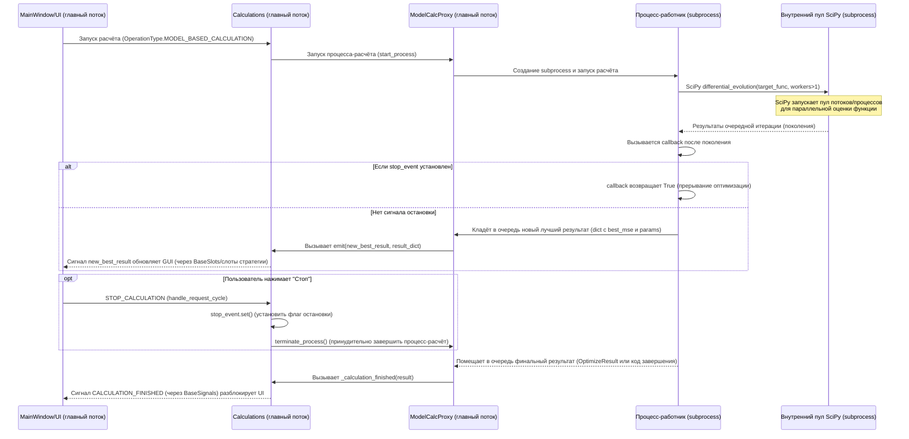

Хорошо, подготовлю полноценное техническое задание для переноса `model_based_calculation` в отдельный процесс с сохранением multiprocessing-воркеров внутри и мгновенным завершением. Оно будет соответствовать критериям: минимальные изменения, модульность, элегантность и логичность. В ТЗ включу mermaid-диаграмму, уточнённую архитектуру и примеры кода.


# Техническое задание: вынесение MODEL\_BASED\_CALCULATION в отдельный процесс

## Описание задачи

Необходимо рефакторинговать существующее PyQt6-приложение для анализа кинетики твердофазных реакций, чтобы вынести трудоёмкий расчет **MODEL\_BASED\_CALCULATION** из потока `QThread` в отдельный процесс (`multiprocessing.Process`). В текущей реализации модельный расчет выполняется в фоне с помощью `QThread`, однако при этом используются параллельные вычисления (алгоритм дифференциальной эволюции SciPy) и решения ОДУ, что нагружает CPU и может снижать отзывчивость графического интерфейса. Кроме того, сейчас параллелизм SciPy отключён (`workers=1`) из-за проблем с многопроцессностью в одном процессе GUI. Требуется исправить эти ограничения:

* **Улучшить отзывчивость GUI**: тяжелые вычисления должны выполняться вне основного процесса приложения, чтобы UI не «подвисал» во время расчета.
* **Реализовать мгновенную отмену расчета**: пользователь должен иметь возможность в любой момент прервать модельный расчет без задержек.
* **Сохранить текущий функционал обновления результатов**: промежуточные лучшие результаты оптимизации должны, как и раньше, отображаться в GUI по сигналу `new_best_result`.
* **Не нарушить существующий код**: публичные интерфейсы классов `Calculations`, `MainWindow`, `BaseSlots` и сигналы должны остаться неизменными. Остальные сценарии расчетов (например, деконволюция, model-free и т.д.) по-прежнему выполняются через потоки `QThread`.
* **Учитывать особенность SciPy**: внутри процесса-работника необходимо использовать `scipy.optimize.differential_evolution` с параметром `workers > 1` (например, `workers=-1` для использования всех ядер). Это означает, что внутри нашего процесса-расчёта SciPy создаст собственный пул потоков/процессов для параллельной оценки функций – то есть **вложенные пуллы**. Решение должно корректно работать с такими вложенными пулами на Windows.

## Архитектура решения

Для вынесения расчетов в отдельный процесс предлагается ввести **менеджер расчета** (proxy-класс) в основном процессе и **процесс-работник** для выполнения вычислений. Основной процесс (GUI) будет запускать процесс-работник, передавая ему все необходимые данные (функцию цели, границы параметров, настройки алгоритма и пр.). Обмен данными между процессами будет осуществляться через межпроцессную очередь (`multiprocessing.Queue`) и флаг остановки (`multiprocessing.Event`).

Ниже представлена схема взаимодействия компонентов во время выполнения модельного расчета:



**Примечание:** В диаграмме показан сценарий использования сигнала остановки `stop_event` *и* принудительного прекращения процесса. В реальности при нажатии "Стоп" будет сначала выставлен флаг, что позволит `callback` корректно завершить оптимизацию (если возможно), а затем, не дожидаясь долго, процесс будет принудительно убит для мгновенного освобождения ресурсов.

## Компоненты решения

### Процесс-работник (Worker process)

Процесс-работник будет запускаться для выполнения **только** сценария `model_based_calculation`. Этот процесс реализует функцию-рабочий, которая будет выполнять оптимизацию методом дифференциальной эволюции и общаться с главным процессом через очередь и события. Ключевые аспекты процесса-работника:

* **Функция цели**: В процесс передается готовый объект целевой функции `ModelBasedTargetFunction` (или необходимые данные для его создания). Этот объект инкапсулирует модельный расчет (вызов `model_based_objective_function`) и хранит разделяемые через менеджер значения – лучшая ошибка (MSE) и параметры. В существующем коде `ModelBasedTargetFunction` уже использует `multiprocessing.Manager.Value` и `Manager.list` для хранения лучшего результата, а также `Manager.Event` для флага остановки. Благодаря этому один и тот же объект можно безопасно использовать параллельно в нескольких процессах (в том числе в пуле SciPy) – лучший результат будет храниться **общим** для всех потоков.

* **Инициализация**: При запуске процесса-работника ему передаются:

  * Объект целевой функции `target_func` (включая ссылки на общие объекты Manager, такие как `best_mse`, `best_params`, `lock` и `stop_event`).
  * Границы параметров `bounds` (список кортежей) для дифференциальной эволюции.
  * Словарь настроек алгоритма `method_params` (например, popsize, tol, maxiter и т.д.). **Важно:** в этих параметрах **не будет** PyQt-специфичных объектов. В частности, мы **не передаем** callback из главного процесса, содержащий сигнал Qt, поскольку Qt объекты нельзя сериализовать и отправить в процесс. Вместо этого callback будет определён внутри процесса.
  * Объект очереди `result_queue` (для отправки результатов).
  * Объект события `stop_event` для координации отмены (это `multiprocessing.Event`, созданный через Manager, позволяющий нескольким процессам видеть единый флаг).

* **Выполнение оптимизации**: Процесс-работник вызывает `scipy.optimize.differential_evolution`, передавая ему:

  * `func=target_func` – объект `ModelBasedTargetFunction` как функцию оценки приспособленности.
  * `bounds=bounds` – границы параметров.
  * Прочие параметры из `method_params` (включая `workers > 1` для параллелизма).
  * `callback=...` – **собственную функцию обратного вызова**, определённую внутри процесса. Эта функция вызывается SciPy в конце каждой итерации (поколения) оптимизации.

* **Callback внутри процесса**: В процессе-работнике мы определяем функцию `callback(xk, convergence)`, замыкающую переменные из окружения процесса:

  * Она проверяет флаг остановки: если `stop_event.is_set() == True`, то callback возвращает `True` для немедленного прерывания оптимизации SciPy (SciPy при получении `True` завершает вычисления досрочно).
  * Если прерывание не запрошено, callback формирует **пакет промежуточного результата** – словарь с текущими лучшими значениями:

    ```python
    {
        "best_mse": target_func.best_mse.value,
        "params": list(target_func.best_params),
    }
    ```

    Эти данные соответствуют формату, используемому сейчас в сигнале `new_best_result`. Словарь отправляется в главный процесс через `result_queue` методом `result_queue.put(...)`. Отправка через очередь безопасна и не блокирует вычисления надолго.
  * Callback всегда возвращает `False`, если не произошло прерывание, чтобы SciPy продолжил оптимизацию.

* **Обработка ограничений**: Если сценарий `ModelBasedScenario` включает ограничения (NonlinearConstraint) на параметры, их нужно учесть и в новом процессе. Поскольку объект `NonlinearConstraint` с локально определенной функцией ограничения может не сериализоваться напрямую, есть два варианта:

  1. **Передача достаточных данных**: передать в процесс исходные данные реакций (например, `reaction_scheme` с цепочками реакций) и воспроизвести вычисление списка ограничений там. Можно использовать метод Scenario для генерации ограничения. Например, вызвать статический метод или ту же функцию, что формирует `NonlinearConstraint`, но уже внутри процесса.
  2. **Сериализация функции ограничения**: сделать функцию ограничения модульной (определённой на уровне модуля), чтобы объект `NonlinearConstraint` стал сериализуемым. В рамках данного ТЗ приемлем первый путь: в процесс передается структура данных схемы реакций, и внутри процесса создаётся такой же `NonlinearConstraint`, как в `ModelBasedScenario.get_constraints()`. Это обеспечит эквивалентность поведения без передачи несериализуемых объектов.

* **Завершение расчета и возврат**: По завершении оптимизации (либо по достижении максимальных итераций, либо из-за прерывания) процесс-работник отправляет в очередь итоговые данные:

  * Если удалось получить результат (`OptimizeResult`), он отправляется как объект (при условии, что он сериализуем). `OptimizeResult` в SciPy – это подкласс `dict`, содержащий, например, `x`, `fun`, `message`, `success`. Такой объект можно отправить через очередь. Главный процесс распознает его и обработает так же, как сейчас обрабатывается результат из потока.
  * Если оптимизация прервана и бросает исключение (например, SciPy может сгенерировать исключение при возвращении `inf` как у нас, с сообщением "array must not contain infs or NaNs"), процесс-работник должен перехватить это исключение. В случае прерывания мы можем считать это **не ошибкой**, а нормальным завершением. Поэтому если поймано исключение, вместо трассировки оно отправляется как особый признак завершения. Например, можно отправить через очередь словарь `{"terminated": True}` или Exception объект. В главном процессе это будет интерпретировано как успешная отмена (см. далее обработку).
  * **Принудительное убийство процесса**: Если главный процесс решит прибегнуть к `process.terminate()`, процесс-работник может завершиться без возможности отправить финальное сообщение. Поэтому основной процесс должен быть готов обнаружить отсутствие финального результата (например, проверять `exitcode` процесса). Стратегия: мы сначала пытаемся грамотно остановить (выставляем флаг и даём callback вернуть результат), но если это не сработало быстро – процесс принудительно завершается. Окончательное уведомление GUI о завершении всё равно произойдёт (см. ниже интеграцию).

### Прокси-класс (менеджер процесса) в основном процессе

В основном процессе будет реализован класс, условно назовём его `ModelCalcProxy` (или похожее название), отвечающий за управление процессом-работником и интеграцию с PyQt. Его функции:

* **Запуск процесса**: Метод `start_process(target_func, bounds, method_params)` создаёт новый объект `multiprocessing.Process`. В конструктор процесса передаётся целевая функция (например, модульная функция `run_model_calc`) и аргументы:

  1. `target_func` – объект `ModelBasedTargetFunction` (включающий внутри себя `stop_event`, `best_mse` и пр.).
  2. `bounds` – границы параметров.
  3. `method_params` – словарь настроек (после удаления/игнорирования `callback`, т.к. он будет задан внутри).
  4. `stop_event` – разделяемое событие (тот же `calculations.stop_event`).
  5. `result_queue` – очередь (`multiprocessing.Queue`).

  Перед запуском процесса прокси может установить необходимые флаги и структуры, например очистить `stop_event` на всякий случай (при начале нового расчёта) и отметить флаг `calculation_active = True`. Далее вызывается `process.start()`, и новый процесс начинает выполнение.

* **Чтение результатов**: Прокси-класс будет отслеживать сообщения из очереди в асинхронном режиме и перенаправлять их в систему сигналов Qt. Есть два способа это сделать:

  1. **Через QTimer**: Создать таймер (например, с интервалом 100 мс), который регулярно проверяет `result_queue`. Такой таймер, запущенный в главном потоке, не блокирует UI и позволяет периодически читать очередь.
  2. **Через вспомогательный поток**: Запустить отдельный поток-потребитель, который блокируется на чтении из очереди и при получении данных эмитирует сигнал в GUI. Однако этот подход усложнён — придётся синхронизировать с Qt потоками.

  Предпочтительно использовать **QTimer** для простоты и достаточной реактивности. Реализация: после запуска процесса прокси создаёт QTimer, подключает его сигнал `timeout` к слоту (методу) `on_queue_poll()`, который выполняет:

  * Пока в очереди есть сообщения (`result_queue.qsize() > 0`), извлекает их в порядке поступления.
  * Для каждого сообщения:

    * Если сообщение содержит ключи промежуточного результата (`"best_mse"` и `"params"`), то прокси вызывает `calculations.new_best_result.emit(msg_dict)`. Тем самым генерируется тот же сигнал, который раньше посылался из потока через `make_de_callback`, но теперь инициатором выступает главный процесс. Сигнал `new_best_result` уже подключён к слоту `Calculations.handle_new_best_result`, поэтому существующая логика обновления результатов (стратегия `ModelBasedCalculationStrategy`, обновление GUI графиков/таблиц) сработает без изменений.
    * Если сообщение содержит финальный результат – проверяем его тип:

      * Если это `OptimizeResult` (или помечено как финальный результат, например, ключ `"final_result"`), то отключаем таймер (больше сообщений не ожидается) и вызываем метод `calculations._calculation_finished(result)`. Мы напрямую вызываем слот, минуя поток, но это допустимо, поскольку находимся в главном потоке (через таймер). Можно также эмитировать сигнал, связанный со слотом `_calculation_finished`, но прямой вызов упрощает задачу.
      * Если это объект исключения или сигнал принудительной остановки (напр. `{"terminated": True}`), то трактуем его как завершение без результата. В этом случае также останавливаем таймер и вызываем `calculations._calculation_finished(признак_остановки)`. Внутри `_calculation_finished` уже реализована логика: если результат – Exception с текстом "array must not contain infs or NaNs", выводится сообщение "Calculation was successfully terminated". Мы можем имитировать это поведение, передав соответствующий Exception или отлавливать внутри `_calculation_finished`.
    * После обработки финального сообщения прокси вызывает `process.join()` для очищения ресурсов процесса (не блокируя UI, т.к. на тот момент процесс уже завершён). Также сбрасывает `self.process = None` и прочие внутренние состояния, если нужно.

* **Прерывание и завершение процесса**: Прокси предоставляет метод `stop_process()` для отмены вычисления. Этот метод вызывается из `Calculations.stop_calculation()` вместо стандартного завершения потока:

  * Устанавливается флаг остановки: `stop_event.set()`. Поскольку `stop_event` – общий (через Manager), процесс-работник и все его дочерние потоки сразу "увидят" этот сигнал. Например, `ModelBasedTargetFunction.__call__` при каждом вызове проверяет `stop_event` и возвращает `inf`, если он установлен, что не даст новым вычислениям продолжаться. Callback тоже проверяет флаг и вернёт True, останавливая алгоритм.
  * После установки флага можно дать небольшую паузу (буквально 100-200 мс) на то, чтобы SciPy корректно прервалась и отправила финальное сообщение. В большинстве случаев этого достаточно, если прерывание произошло в момент вычисления новой итерации.
  * **Принудительное завершение**: Для гарантии мгновенной отмены вызывается `process.terminate()`. Этот вызов на Windows немедленно убивает процесс-работник. Несмотря на попытку graceful-остановки, мы не можем полагаться, что SciPy быстро отреагирует (особенно если внутри ODE интегратор). Поэтому `terminate()` обеспечивает выполнение требования "мгновенного завершения". Нужно учитывать, что при terminate дочерние процессы/потоки SciPy могут остаться висеть. Однако в случае `multiprocessing.Pool` дети должны завершиться при закрытии дескриптора родителя, либо их тоже придется убивать. В рамках ТЗ считаем, что `terminate()` достаточен (в тестировании будет проверено, остаются ли дочерние процессы SciPy).
  * Прокси также должен корректно обработать сценарий, когда процесс убит до того, как он отправил результат. Мы уже описали выше: при отсутствии финального сообщения, но при `exitcode` процесса != 0, считается, что произошло принудительное прекращение. Вызовем `calculations._calculation_finished(Exception("Process terminated"))` или аналог, чтобы GUI узнал о завершении. Либо можем непосредственно вызвать `handle_request_cycle("main_window", OperationType.CALCULATION_FINISHED)` как это делается в конце `_calculation_finished`, имитируя успешное завершение.

* **Интеграция с сигналами Qt**: Прокси сам по себе может не быть QObject, однако он использует объект `calculations` (который является `BaseSlots` и QObject) для генерации сигналов. Альтернативно, можно сделать `ModelCalcProxy` наследником `QObject` с собственным сигналом, но это усложнит без необходимости. Проще вызывать существующий сигнал:

  ```python
  self.calculations.new_best_result.emit(result_dict)
  ```

  из метода обработки очереди. Поскольку этот метод работает в главном потоке (через QTimer), сигнал будет эмитирован также в контексте главного потока и обработается синхронно в основном цикле Qt. Таким образом, требование интеграции в систему сигналов через `new_best_result` выполняется прозрачно – для остальной части приложения источник сигнала не важен, он подключён и обрабатывается так же, как ранее.

* **Модульность решения**: Класс-прокси будет изолирован в отдельном модуле, например `model_calc_manager.py`. Он не будет влиять на остальные части приложения. В классе `Calculations` будет лишь храниться экземпляр прокси и вызываться его методы. При необходимости, прокси можно будет переиспользовать или расширить для других видов расчетов, не меняя логику `Calculations`.

##### Пример: запуск процесса и получение прогресса

Ниже показан упрощённый псевдокод, иллюстрирующий устройство процесса-работника и взаимодействие с очередью:

```python
# --- В модуле отдельного процесса (например, model_calc_worker.py) ---
from scipy.optimize import differential_evolution

def run_model_calc(target_func, bounds, method_params, stop_event, result_queue):
    # Определяем callback внутри процесса
    def de_callback(xk, convergence):
        if stop_event.is_set():
            # Прерывание: останавливаем оптимизацию
            return True
        # Отправка лучшего найденного на данный момент решения в главное окно
        best = target_func.best_mse.value
        params = list(target_func.best_params)
        result_queue.put({"best_mse": best, "params": params})
        return False

    # Включаем наш callback в параметры оптимизации
    method_params["callback"] = de_callback
    try:
        # Запуск дифференциальной эволюции (с внутренним параллелизмом workers>1)
        result = differential_evolution(target_func, bounds, **method_params)
        # По окончании отправляем полученный результат
        result_queue.put({"final_result": result})
    except Exception as e:
        # Отправляем информацию об ошибке или прерывании
        err_msg = str(e)
        result_queue.put({"error": err_msg})
```

В этом коде:

* `target_func` – ранее созданный `ModelBasedTargetFunction` с общими памятью и флагом.
* `stop_event` и `result_queue` – объекты, пришедшие из главного процесса.
* В callback мы отправляем только необходимые данные (число и список), чтобы не перегружать очередь. Никаких Qt сигналов здесь нет – чистые питоновские объекты.
* При возникновении исключения (например, при вызове `return float("inf")` в целевой функции и последующей ошибке SciPy) мы отправляем его текст. Это упростит обработку в главном процессе.

##### Пример: менеджер в главном процессе (фрагменты)

```python
class ModelCalcProxy:
    def __init__(self, calculations_obj):
        self.calculations = calculations_obj  # ссылка на Calculations для сигналов
        self.process = None
        self.queue = None
        self.timer = None

    def start_process(self, target_func, bounds, method_params):
        # Очистка и подготовка
        self.calculations.stop_event.clear()
        self.queue = multiprocessing.Queue()
        # Запуск подпроцесса
        self.process = multiprocessing.Process(
            target=run_model_calc,
            args=(target_func, bounds, method_params, self.calculations.stop_event, self.queue)
        )
        self.process.start()
        # Запуск таймера для опроса очереди
        self.timer = QTimer()
        self.timer.setInterval(100)  # 100 мс, например
        self.timer.timeout.connect(self._poll_queue)
        self.timer.start()

    def _poll_queue(self):
        # Читаем все доступные сообщения из очереди
        while not self.queue.empty():
            msg = self.queue.get()
            # Проверка типа сообщения
            if isinstance(msg, dict) and "best_mse" in msg:
                # Промежуточный результат
                self.calculations.new_best_result.emit(msg)
            elif isinstance(msg, dict) and "final_result" in msg:
                # Финальный результат (OptimizeResult внутри)
                res = msg["final_result"]
                self._finish_process(res)
            elif isinstance(msg, dict) and "error" in msg:
                # Ошибка или прерывание
                err = msg["error"]
                # Создаём исключение для передачи в _calculation_finished
                res = Exception(err)
                self._finish_process(res)
        # Если процесс уже завершился и очередь пуста – можно выключить таймер
        if self.process and not self.process.is_alive():
            self.timer.stop()
            # Если мы оказались здесь без финального результата, завершаем
            if self.process.exitcode != 0:
                # Процесс был прерван принудительно
                self._finish_process(Exception("terminated"))
    def _finish_process(self, result_obj):
        """Обработка завершения процесса (успешно или прервано)."""
        self.timer.stop()
        # Завершаем процесс, если еще не
        if self.process and self.process.is_alive():
            self.process.terminate()
        if self.process:
            self.process.join()
        self.process = None
        # Сбрасываем состояние Calculations
        self.calculations._calculation_finished(result_obj)
```

В приведённом примере метод `_finish_process` останавливает таймер, заверяет завершение/убийство процесса, и затем напрямую вызывает `Calculations._calculation_finished`. Метод `_calculation_finished` уже выполняет очистку состояния `Calculations` (установка `calculation_active=False`, сброс лучшего результата и истории, генерация сигнала `CALCULATION_FINISHED` на `MainWindow` и т.д.). Таким образом, GUI получит оповещение о завершении расчёта тем же способом, что и раньше, только через другой маршрут.

Метод `stop_process` будет очень коротким, так как основная логика вынесена в Proxy:

```python
    def stop_process(self):
        if self.process and self.process.is_alive():
            # Сигнализируем о желании остановки
            self.calculations.stop_event.set()
            # Ждем короткий интервал для graceful-остановки (опционально, например 0.1 с)
            QTimer.singleShot(100, lambda: (
                self.process.is_alive() and self.process.terminate()
            ))
            return True
        return False
```

Здесь через `singleShot` выполнено отложенное завершение: через 100 мс, если процесс ещё жив, убиваем его.

### Изменения в классе `Calculations` и связанные адаптации

Основной класс `Calculations` потребуется минимально изменить для использования нового процесса. Важно, что **интерфейс класса** (его публичные методы и сигналы) останется прежним:

* **Атрибуты**: Добавится атрибут для прокси. Его можно инициализировать в конструкторе `Calculations`:

  ```python
  self.model_calc_proxy = ModelCalcProxy(self)
  ```

  Это не повлияет на существующий код, поскольку к `model_calc_proxy` будут обращаться только новые ветви кода.

* **Запуск сценария расчета**: В слоте `run_calculation_scenario(self, params: dict)` добавится условие для сценария *model\_based\_calculation*. Сейчас там происходит выбор сценария и запуск потока:

  ```python
  if scenario_key == "model_based_calculation":
      # ... получение target_function, bounds, constraints
      calc_params = params.get("calculation_settings", {}).get("method_parameters", {}).copy()
      calc_params["constraints"] = scenario_instance.get_constraints()
      calc_params["callback"] = make_de_callback(target_function, self)
      self.start_differential_evolution(bounds=bounds, target_function=target_function, **calc_params)
  ```

  Эта логика будет изменена так, чтобы вместо использования `start_differential_evolution` (запускающего QThread) вызвать метод прокси. Примерно так:

  ```python
  if scenario_key == "model_based_calculation":
      # подготовка целевой функции и параметров
      bounds = scenario_instance.get_bounds()
      constraints = scenario_instance.get_constraints()
      target_function = scenario_instance.get_target_function(calculations_instance=self)
      method = scenario_instance.get_optimization_method()  # должно быть "differential_evolution"
      # формируем копию параметров алгоритма
      method_params = params.get("calculation_settings", {}).get("method_parameters", {}).copy()
      method_params["constraints"] = constraints  # если не пустой
      # Не устанавливаем method_params["callback"], он не нужен для subprocess
      # Запускаем процесс через прокси
      self.model_calc_proxy.start_process(target_function, bounds, method_params)
      # Устанавливаем стратегию результатов
      strategy_type = scenario_instance.get_result_strategy_type()  # "model_based_calculation"
      self.set_result_strategy(strategy_type)
  elif scenario_key == "deconvolution":
      # поведение для других сценариев без изменений
      ...
  ```

  Таким образом, для `model_based_calculation` будет задействован новый путь. Мы исключаем вызов `make_de_callback` при работе через процесс, чтобы не передавать Qt-сигнал. **Обмен результатами теперь происходит через очередь, а сигнал `new_best_result` генерируется прокси-менеджером.**

* **Остановка расчета**: В методе `stop_calculation` класса `Calculations` нужно учесть и случай процесса. Сейчас там реализовано прекращение потока:

  ```python
  if self.thread and self.thread.isRunning():
      self.stop_event.set()
      self.calculation_active = False
      self.result_strategy = None
      self.thread.requestInterruption()
      console.log("Calculation thread has been requested to stop...")
      return True
  ```

  Добавляем дополнительную ветвь:

  ```python
  if self.model_calc_proxy.process and self.model_calc_proxy.process.is_alive():
      logger.info("Stopping current calculation (subprocess).")
      self.model_calc_proxy.stop_process()
      self.calculation_active = False
      self.result_strategy = None
      console.log("\nCalculation process has been requested to stop.")
      return True
  ```

  Так мы переадресуем остановку на прокси-менеджер. В остальном, остальная часть метода остаётся, включая вывод "No active calculation to stop.".

* **Сигнал `new_best_result`**: Он уже объявлен в `Calculations` и подключен к обработчику `handle_new_best_result`. Мы не меняем это — просто теперь эмиттером сигнала будет не callback потока, а наш прокси. Для самого обработчика разницы нет. Таким образом, **класс `MainWindow` и другие части UI, которые получали обновления через `new_best_result` и через сигнал `CALCULATION_FINISHED`, будут работать как раньше**, без изменений.

* **Callback SciPy**: Функция `make_de_callback` больше не используется для модельного расчета. Она остаётся в коде на случай, если она нужна для других сценариев (хотя по коду видно, что она специфична для model\_based). Можно оставить её для совместимости, но следить, чтобы она не вызывалась для subprocess-ветви. Мы фактически заменили её функциональность на межпроцессовой уровень.

* **ModelBasedTargetFunction**: Этот класс можно использовать без изменений. Он уже учитывает `stop_event` и обновляет `best_mse` в общем хранилище с блокировкой. На будущее, можно убедиться, что он не содержит внутри не-сериализуемых объектов. Судя по инициализации, в нём хранятся только массивы numpy, списки, manager.Value, manager.list, Lock и Event – всё это сериализуется и/или доступно из других процессов. Единственный потенциальный момент – использование логгера (`logger.error` внутри метода), но логгер на новый процесс не распространится автоматически. Это не критично: при ошибках мы пересылаем исключение в главный процесс и там логируем. При необходимости можно настроить логирование в процессе-работнике (например, логировать в отдельный файл).

## Расширяемость решения

Предложенное решение спроектировано модульно и гибко, что облегчит его поддержку и развитие:

* **Модульная архитектура**: Логика вынесена в отдельный класс `ModelCalcProxy` и вспомогательную функцию процесса. Это соответствует принципу слабого связывания – основной код `Calculations` минимально осведомлён о деталях реализации (он лишь вызывает методы прокси).
* **Минимальные изменения**: Существующие интерфейсы и сигналы не изменились, новые компоненты добавлены как расширение. Это согласуется с принципом расширяемости – новый модуль интегрируется через уже имеющийся BaseSlots механизм сигналов.
* **Повторное использование для других расчётов**: Хотя сейчас выносится только `model_based_calculation`, по аналогии можно вынести и другие тяжёлые операции. Например, если в будущем потребуется параллельно вычислять сложный сценарий деконволюции, можно создать схожий Proxy + worker process для него. Можно даже обобщить решение: сделать универсальный `CalculationProcessManager`, способный запускать в subprocess любую функцию, а не только SciPy DE. Однако, учитывая специфичность интеграции (разные функции могут требовать разный формат данных), лучше наращивать функциональность отдельными модулями по мере необходимости.
* **Вложенные процессы**: Вынесение тяжёлого расчёта из главного процесса позволит безопасно включить параллелизм SciPy. Теперь параметр `workers` можно вернуть к `-1` или >1 для использования всех CPU, не опасаясь конфликтов с PyQt. Главный процесс остаётся responsive, а все тяжёлые вычисления (и их потоки) изолированы. Таким образом, требование о вложенных пулах выполнено: во внешнем процессе можно без ограничений использовать `multiprocessing.Pool` внутри SciPy.
* **Безопасность на Windows**: Предлагаемая реализация учитывает особенности Windows (spawn). В частности, мы избегаем передачи в subprocess неподдерживаемых объектов (Qt-сигналов, нестатических функций). Все функции и классы, передаваемые в процесс, определены на уровне модуля, что позволяет модулю процесса импортироваться и быть запущенным. Нужно убедиться, что запуск процесса обёрнут проверкой `if __name__=="__main__":` в точке входа приложения (обычно это уже есть), иначе spawn на Windows может рекурсивно создавать процессы. Предусмотрено использование `multiprocessing.Manager` для объектов (Event, Value, Lock), что совместимо с Windows.

## Стратегия тестирования и отладки

Для внедрения изменений требуется тщательное тестирование, учитывающее как корректность вычислений, так и взаимодействие с UI:

1. **Функциональная корректность**: Запустить модельный расчет с известными настройками и убедиться, что результат совпадает с прежней версией (до рефакторинга) при `workers=1`. Малые тестовые задачи (с небольшим числом итераций) помогут проверить, что алгоритм в subprocess выдаёт ожидаемый `OptimizeResult` и обновления.

2. **Отзывчивость UI**: На длительных расчетах проверить, что интерфейс остаётся интерактивным:

   * Окно не зависает, можно перемещать, сворачивать.
   * Прогресс/лучшие результаты обновляются плавно (с той частотой, которая получается от SciPy; возможно, несколько раз в секунду, в зависимости от `callback` вызовов).
   * Кнопка "Stop" реагирует мгновенно.

3. **Прерывание расчета**: Протестировать различные моменты отмены:

   * Отмена сразу после старта (чтобы проверить, что даже если процесс ещё инициализируется, мы его успешно останавливаем).
   * Отмена в середине расчета, когда уже идут итерации.
   * Многократное нажатие "Stop" (не должно вызывать ошибок).
   * Проверить, что после остановки интерфейс корректно возвращается в исходное состояние (кнопки становятся активны, выводится сообщение о прекращении, частичный результат не мешает дальнейшим действиям).
   * Убедиться, что при отмене не остаётся запущенных процессов-потомков: после нескольких запусков и остановов можно просмотреть в Диспетчере задач, нет ли "висящих" python процессов. При обнаружении – отладить завершение пулов.

4. **Параллельное выполнение**: Хотя в UI, вероятно, расчёт запускается последовательно, стоит проверить, что повторный запуск сценария после предыдущего корректно работает. На случай, если пользователь быстро запустит новый расчет после завершения предыдущего, старый процесс уже должен быть правильно освобождён (join выполнен, объекты очереди закрыты). Наш код очищает `self.process` и создаёт новый Queue, что должно исключить конфликт, но тест это подтвердит.

5. **Логирование и отладка**: В процессе разработки полезно временно добавить дополнительные логи:

   * Логировать в `ModelCalcProxy._poll_queue` получение каждого сообщения и тип результата.
   * Логировать запуск и остановку процесса (`process.pid`, `exitcode`).
   * Возможно, логировать внутри `run_model_calc` начало и конец оптимизации.
     Эти логи можно выводить в консоль или в файл. Поскольку `logger` из `logger_config` может быть не настроен на межпроцессную работу, для отладки процесса-работника можно использовать обычные `print()` (они будут видны в консоли, откуда запущено приложение) или настроить файл для логов.
     После проверки стабильности лишние логи надо будет убрать или понизить до debug-уровня.

6. **Обработка ошибок**: Нарочно спровоцировать ошибку внутри расчета (например, задать некорректные параметры, чтобы `model_based_objective_function` бросила исключение) и убедиться, что:

   * Процесс завершается, ошибка передаётся в главный процесс и логируется через существующий механизм (`logger.error` в `_calculation_finished`).
   * UI уведомляет пользователя (например, выводит сообщение об ошибке, если заложено).
   * Приложение не зависает и остаётся работоспособным после ошибки.

7. **Память и ресурсы**: При повторных запусках убедиться, что нет утечек ресурсов:

   * Память возвращается (нет неконтролируемого роста после каждого завершенного процесса).
   * Количество потоков/процессов возвращается к исходному (например, можно мониторить, что после завершения нет активных worker-процессов SciPy).
   * Менеджер `multiprocessing.Manager` не порождает новых процессов каждый раз без удаления старых. (Если это проблема, можно создать один Manager в `Calculations` и переиспользовать его, что мы фактически делаем, сохраняя `self.manager` и `self.stop_event`).

8. **Кросс-платформенность (опционально)**: Хотя платформа целевая – Windows, проверить на Linux/Mac (если возможно) корректность, т.к. на Unix используется `fork`. Архитектура должна работать и там; главное – убрать Windows-специфичные ограничения (что и сделано).

По итогам тестирования и отладки, следует обновить документацию (например, **ARCHITECTURE.md**) с описанием новой схемы расчёта. В ней можно отразить, что теперь `MODEL_BASED_CALCULATION` реализован на subprocess-процессах, указать, какой модуль отвечает за эту логику, и как взаимодействуют компоненты (можно включить мермаид-диаграмму, подобную приведенной выше, для наглядности). Кроме того, нужно описать, как новые изменения вписываются в **систему логирования операций** .

Таким образом, предлагаемое решение позволит выполнять тяжёлые модельно-ориентированные расчёты в отдельном процессе, не блокируя интерфейс и позволяя мгновенно прерывать вычисления. Все это достигается с минимальными изменениями существующего кода и с соблюдением архитектурных принципов приложения (сигнально-слотная коммуникация, слабая связность модулей и расширяемость).
