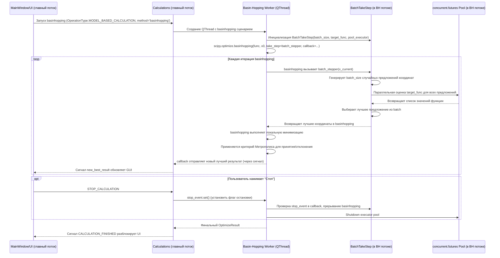

# Этап 2: Backend интеграция basinhopping

## Описание этапа

Второй этап фокусируется на интеграции BatchTakeStep с существующей архитектурой MODEL_BASED_CALCULATION. Этот этап расширяет ModelBasedScenario для поддержки basinhopping оптимизации с минимальными изменениями в existing коде и полной совместимостью с differential_evolution.

## Цели этапа

- **Расширить ModelBasedScenario** для поддержки выбора между differential_evolution и basinhopping
- **Интегрировать BatchTakeStep** в basinhopping workflow с корректным управлением ресурсами
- **Обеспечить backward compatibility** - differential_evolution остается без изменений
- **Реализовать параметры basinhopping** (T, niter, stepsize, minimizer_kwargs)
- **Добавить конфигурацию по умолчанию** для новых параметров в app_settings
- **Обеспечить интеграцию с логированием** и существующими сигналами Qt

## Зависимости

- ✅ **Этап 1 завершен**: BatchTakeStep класс полностью реализован и протестирован
- ✅ **Существующая архитектура**: ModelBasedScenario, ModelBasedTargetFunction, Qt сигналы

## Архитектура решения

### Архитектурная диаграмма basinhopping workflow

Схема взаимодействия компонентов во время выполнения basinhopping расчета:



### Расширение ModelBasedScenario

**Файл**: `src/core/calculation_scenarios.py` (модификация)

```python
class ModelBasedScenario:
    """Расширение для поддержки basinhopping оптимизации"""
    
    def run(self, target_func, bounds, method_params, stop_event):
        """
        Главный метод запуска оптимизации с выбором алгоритма
        
        Поддерживаемые методы:
        - 'differential_evolution' (по умолчанию, existing)
        - 'basinhopping' (новый, с BatchTakeStep)
        """
        method = method_params.get('optimization_method', 'differential_evolution')
        
        if method == 'differential_evolution':
            # Существующий код без изменений
            return self._run_differential_evolution(target_func, bounds, method_params, stop_event)
        elif method == 'basinhopping':
            # Новый метод с BatchTakeStep
            return self._run_basinhopping(target_func, bounds, method_params, stop_event)
        else:
            raise ValueError(f"Unsupported optimization method: {method}")
    
    def _run_basinhopping(self, target_func, bounds, method_params, stop_event):
        """
        Запуск basinhopping оптимизации с Batch-Stepper распараллеливанием
        
        Args:
            target_func: ModelBasedTargetFunction instance
            bounds: Границы параметров для оптимизации
            method_params: Параметры basinhopping из UI
            stop_event: Event для прерывания вычислений
            
        Returns:
            scipy.optimize.OptimizeResult с результатами оптимизации
        """
        
    def _create_batch_stepper(self, method_params, target_func, stop_event):
        """Создание и конфигурация BatchTakeStep instance"""
        
    def _create_progress_callback(self, stop_event):
        """Создание callback для отслеживания прогресса и остановки"""
        
    def _setup_minimizer_kwargs(self, bounds, method_params):
        """Настройка параметров локального минимизатора"""
```

### Конфигурация basinhopping параметров

**Файл**: `src/core/app_settings.py` (расширение)

```python
# Использование DEFAULT_BASINHOPPING_PARAMS из stage_01
# Дополнительные настройки для ModelBasedScenario integration

# Constraints поддержка для basinhopping
BASINHOPPING_CONSTRAINT_METHODS = ['SLSQP', 'trust-constr']  # Методы с поддержкой constraints

# Performance настройки
BASINHOPPING_PERFORMANCE_CONFIG = {
    'adaptive_batch_sizing': True,           # Автоматическая адаптация batch_size к CPU
    'memory_limit_mb': 512,                 # Ограничение памяти для batch операций
    'timeout_seconds': None,                # Timeout для individual evaluations
}
```

### Интеграция с логированием

**Расширение для поддержки basinhopping в системе агрегированного логирования** (из ТЗ):

```python
from src.core.log_aggregator import operation

class ModelBasedScenario:
    @operation
    def run(self, target_func, bounds, method_params, stop_event):
        """
        Автоматически логируется:
        - Время выполнения basinhopping/differential_evolution
        - Подоперации (handle_request_cycle вызовы) 
        - Статус успеха/ошибки
        - Тип метода оптимизации (differential_evolution / basinhopping)
        - Финальные результаты и метрики
        """
        method = method_params.get('optimization_method', 'differential_evolution')
        
        if method == 'basinhopping':
            return self._run_basinhopping(target_func, bounds, method_params, stop_event)
        else:
            return self._run_differential_evolution(target_func, bounds, method_params, stop_event)
```

### Интеграция с существующими компонентами

**Модификации Calculations класса**:

```python
class Calculations(BaseSlots):
    """Минимальные изменения для поддержки basinhopping"""
    
    def process_request(self, request):
        """Расширение для передачи optimization_method параметра"""
        if request.operation == OperationType.MODEL_BASED_CALCULATION:
            # Добавление optimization_method в method_params если отсутствует
            method_params = request.kwargs.get('method_params', {})
            if 'optimization_method' not in method_params:
                method_params['optimization_method'] = 'differential_evolution'
                
            # Existing логика остается без изменений
            return self._handle_model_based_calculation(request)
```

**ModelBasedTargetFunction совместимость**:
- Класс остается без изменений
- BatchTakeStep работает с existing `__call__` интерфейсом
- Разделяемые объекты (best_mse, best_params) совместимы с Manager

## Технические требования

### Параметры basinhopping

**Temperature (T)**:
- **Диапазон**: 0.1 - 10.0
- **По умолчанию**: 1.0
- **Назначение**: Контроль критерия Метрополиса для принятия/отклонения

**Number of iterations (niter)**:
- **Диапазон**: 10 - 1000  
- **По умолчанию**: 100
- **Назначение**: Количество итераций basinhopping алгоритма

**Step size (stepsize)**:
- **Диапазон**: 0.01 - 2.0
- **По умолчанию**: 0.5
- **Назначение**: Размер шага для BatchTakeStep генерации предложений

**Batch size**:
- **Диапазон**: 2 - 16
- **По умолчанию**: min(4, os.cpu_count())
- **Назначение**: Количество параллельных предложений в BatchTakeStep

### Локальные минимизаторы

**L-BFGS-B** (рекомендуемый):
- ✅ Поддержка bounded constraints
- ✅ Эффективность для гладких функций
- ✅ Хорошая сходимость для кинетических параметров

**SLSQP**:
- ✅ Поддержка нелинейных constraints
- ⚠️ Может быть медленнее на больших задачах

**TNC**:
- ✅ Robust для не очень гладких функций
- ✅ Хорошая обработка bounded constraints

### Управление ресурсами и остановка

**Stop event интеграция**:
- Проверка `stop_event.is_set()` в progress callback
- Прерывание basinhopping через `return True` в callback
- Автоматическая очистка BatchTakeStep ресурсов в `finally` блоке

**Exception handling**:
- Корректная обработка ошибок в BatchTakeStep
- Transparent error propagation к UI layer

## Критерии приемки

### Функциональные тесты

1. **Метод selection**:
   - ✅ По умолчанию используется differential_evolution (backward compatibility)
   - ✅ Корректное переключение на basinhopping при соответствующем параметре
   - ✅ Валидация неподдерживаемых методов

2. **Basinhopping execution**:
   - ✅ Корректная передача всех параметров в scipy.optimize.basinhopping
   - ✅ Интеграция BatchTakeStep с target_func
   - ✅ Работа progress callback для GUI updates

3. **Resource management**:
   - ✅ Автоматическая очистка BatchTakeStep при завершении/остановке
   - ✅ Корректное завершение всех процессов при stop_event
   - ✅ Отсутствие zombie processes после расчетов

### Совместимость тесты

1. **Backward compatibility**:
   - ✅ Все existing differential_evolution тесты проходят без изменений
   - ✅ UI без параметра optimization_method использует differential_evolution
   - ✅ Existing сигналы (new_best_result, CALCULATION_FINISHED) работают

2. **Qt integration**:
   - ✅ Basinhopping progress updates через existing signals
   - ✅ Stop button корректно прерывает basinhopping
   - ✅ GUI остается responsive во время расчетов

### Производительные тесты

1. **Optimization quality**:
   - ✅ Basinhopping находит сопоставимые или лучшие решения на тестовых задачах
   - ✅ Batch-Stepper показывает ускорение vs sequential basinhopping
   - ✅ Конвергенция comparable с differential_evolution

2. **Scalability**:
   - ✅ Эффективное использование доступных CPU cores
   - ✅ Minimal memory overhead по сравнению с differential_evolution
   - ✅ Stable performance на длительных расчетах

## Тестовые сценарии

### Модульные тесты

**Файл**: `tests/test_model_based_basinhopping.py`

```python
import pytest
from unittest.mock import Mock, patch
from src.core.calculation_scenarios import ModelBasedScenario

class TestModelBasedBasinhopping:
    """Тестирование basinhopping интеграции в ModelBasedScenario"""
    
    def test_method_selection_differential_evolution(self):
        """Тест выбора differential_evolution (по умолчанию)"""
        
    def test_method_selection_basinhopping(self):
        """Тест выбора basinhopping метода"""
        
    def test_basinhopping_parameter_passing(self):
        """Тест корректной передачи параметров в basinhopping"""
        
    def test_batch_stepper_integration(self):
        """Тест интеграции с BatchTakeStep"""
        
    def test_progress_callback(self):
        """Тест progress callback для GUI updates"""
        
    def test_stop_event_handling(self):
        """Тест прерывания basinhopping через stop_event"""
        
    def test_resource_cleanup(self):
        """Тест корректной очистки ресурсов"""
        
    def test_error_handling(self):
        """Тест обработки ошибок в basinhopping"""
```

### Интеграционные тесты

**Файл**: `tests/test_basinhopping_integration.py`

```python
def test_end_to_end_basinhopping():
    """End-to-end тест basinhopping оптимизации"""
    
def test_comparison_with_differential_evolution():
    """Сравнение результатов basinhopping vs differential_evolution"""
    
def test_qt_signals_integration():
    """Тест интеграции с Qt signals system"""
    
def test_multiprocessing_stability():
    """Тест стабильности multiprocessing на различных платформах"""
```

### Регрессионные тесты

**Файл**: `tests/test_backward_compatibility.py`

```python
def test_existing_differential_evolution_unchanged():
    """Тест, что existing differential_evolution код не изменился"""
    
def test_default_method_compatibility():
    """Тест backward compatibility при отсутствии optimization_method"""
    
def test_existing_ui_compatibility():
    """Тест совместимости с existing UI без basinhopping параметров"""
```

## Результаты этапа

### Deliverables

1. **ModelBasedScenario расширение** - `_run_basinhopping()` метод  
2. **Конфигурация basinhopping** - параметры в `app_settings.py`
3. **Calculations integration** - минимальные изменения для поддержки
4. **Comprehensive тесты** - модульные, интеграционные, регрессионные
5. **Документация** - обновление docstrings и архитектурных документов

### Метрики качества

- **Test Coverage**: ≥95% для новых basinhopping компонентов
- **Backward Compatibility**: 100% existing tests проходят
- **Performance**: Basinhopping ≥90% качества differential_evolution на benchmark
- **Resource Management**: 0 утечек памяти, все процессы завершены

## Pull Request критерии

### Обязательные проверки

1. ✅ **Все тесты проходят** (новые + existing регрессионные)
2. ✅ **Code coverage ≥95%** для basinhopping integration
3. ✅ **Backward compatibility** - existing functionality без изменений
4. ✅ **Performance benchmarks** - сравнение с differential_evolution
5. ✅ **Resource management** - нет утечек памяти/процессов

### Дополнительные проверки

- ✅ **Cross-platform тестирование** (Windows + Linux CI)
- ✅ **Qt signals integration** - корректная работа с GUI
- ✅ **Error scenarios** - graceful handling всех типов ошибок
- ✅ **Documentation updates** - архитектурные документы актуальны

## Следующий этап

После завершения **Этапа 2**, backend поддержка basinhopping будет полностью интегрирована. **Этап 3: UI компоненты basinhopping** будет создавать пользовательский интерфейс для новой функциональности.
