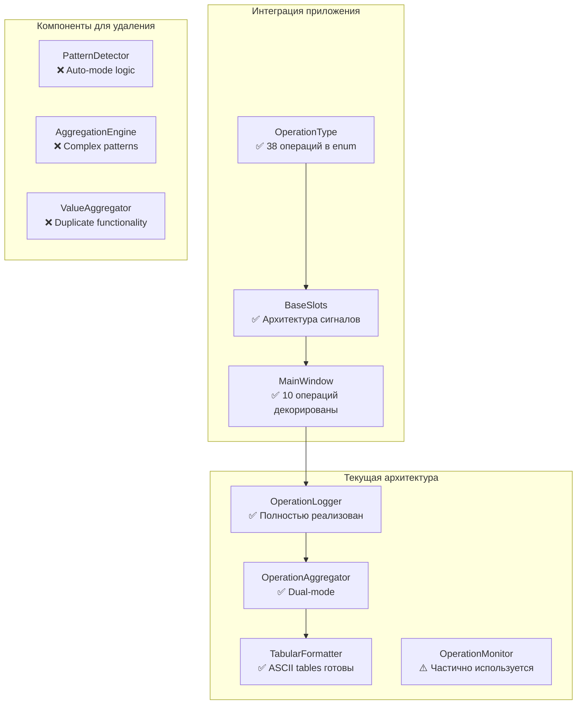

# Этап 1: Анализ проекта и планирование

## Цель этапа
Провести комплексный анализ текущего состояния системы логирования и определить точный план рефакторизации архитектуры обёртки логгера.

## ВЫПОЛНЕНО: Комплексный анализ архитектуры

### 1.1 Анализ текущей архитектуры ✅

#### Система логирования операций

**OperationLogger** (`src/log_aggregator/operation_logger.py`):
- **Статус**: ✅ Активно реализован и используется
- **Функциональность**: Полная реализация с поддержкой:
  - Стек операций с thread-local storage
  - Контекст-менеджер `log_operation()` 
  - Декоратор `@operation`
  - Автоматическое сжатие данных (DataCompressionConfig)
  - Интеграция с OperationAggregator и OperationMonitor
- **Текущее использование**: 10+ мест в `src/gui/main_window.py`

**OperationAggregator** (`src/log_aggregator/operation_aggregator.py`):
- **Статус**: ✅ Полностью реализован с dual-mode support
- **Режимы работы**:
  - `explicit_mode = True` - явное управление операциями
  - `auto_mode` - автоматическое обнаружение по паттернам логов
- **Интеграция**: Активно используется через OperationLogger

#### Текущая интеграция в проекте

**Точки использования декоратора @operation**:
```python
# src/gui/main_window.py - 10 операций уже декорированы:
@operation("MODEL_FREE_CALCULATION")
@operation("MODEL_FIT_CALCULATION") 
@operation("LOAD_DECONVOLUTION_RESULTS")
@operation("SELECT_SERIES")
@operation("MODEL_PARAMS_CHANGE")
@operation("SCHEME_CHANGE")
@operation("DECONVOLUTION")
@operation("ADD_NEW_SERIES")
```

**Система сигналов и слотов**:
- Интеграция с PyQt6 через BaseSignals/BaseSlots
- Централизованная маршрутизация через MainWindow
- Совместимость с существующей архитектурой обмена сообщениями

### 1.2 Аудит кода для удаления ✅

#### Компоненты для удаления/упрощения

**Автоматическое обнаружение операций**:
- ❌ `PatternDetector` (src/log_aggregator/pattern_detector.py) - содержит сложные regex для auto-mode
- ❌ `AggregationEngine` с логикой автоматической группировки  
- ❌ Auto-mode в OperationAggregator

**Дублирующая функциональность**:
- ❌ Отдельные ValueAggregator компоненты (уже интегрированы в OperationLogger)
- ❌ Множественные методы инициализации в operation_logger.py
- ❌ Неиспользуемые паттерны в config.py

**Legacy код**:
- ❌ Устаревшие обработчики логов в realtime_handler.py
- ❌ Сложные эвристики временного окна в buffer_manager.py
- ❌ Неиспользуемые мониторы (performance_monitor.py, optimization_monitor.py)

### 1.3 Инвентаризация существующих компонентов ✅

#### Готовые компоненты для использования

**TabularFormatter** (`src/log_aggregator/tabular_formatter.py`):
- ✅ **Статус**: Полностью реализован и готов к использованию
- **Возможности**: ASCII таблицы с настраиваемыми стилями
- **Интеграция**: Уже подключен к OperationLogger

**OperationType** (`src/core/app_settings.py`):
- ✅ **Статус**: 38 операций определены как Enum
- **Покрытие**: Все основные операции проекта
- **Примеры**: ADD_REACTION, DECONVOLUTION, MODEL_BASED_CALCULATION

**Конфигурация**:
```python
# Готовые параметры в config.py:
@dataclass
class OperationAggregationConfig:
    cascade_window: float = 1.0  # ✅ Временное окно по умолчанию
    enabled: bool = True         # ✅ Включение агрегации
    explicit_mode: bool = True   # ✅ Явный режим
```

**Потокобезопасность**:
- ✅ Thread-local storage в OperationLogger._local
- ✅ Корректная изоляция контекстов операций
- ✅ Безопасная работа с PyQt сигналами

### 1.4 Планирование интеграции ✅

#### Точки внедрения декоратора @operation

**Уже декорированные методы** (10/38 операций):
- MainWindow методы: _handle_model_free_calculation, _handle_model_fit_calculation, etc.

**Требуют декорирования** (28/38 операций):
```python
# src/core/calculation_data_operations.py
- ADD_REACTION, REMOVE_REACTION, UPDATE_VALUE
- IMPORT_REACTIONS, EXPORT_REACTIONS

# src/core/file_data.py  
- LOAD_FILE, RESET_FILE_DATA, TO_DTG, TO_A_T

# src/core/series_data.py
- ADD_NEW_SERIES, UPDATE_SERIES, DELETE_SERIES

# src/core/calculations.py
- DECONVOLUTION, MODEL_BASED_CALCULATION
```

#### Механизм автоматического применения

**Предлагаемый подход**:
1. **Метакласс декоратор** для BaseSlots классов
2. **Автоматическое сопоставление** OperationType → process_request методы
3. **Централизованная регистрация** через BaseSignals

```python
class OperationDecoratedMeta(type):
    def __new__(cls, name, bases, attrs):
        # Автоматически применить @operation к методам process_request
        if 'process_request' in attrs:
            attrs['process_request'] = operation_auto_decorator(attrs['process_request'])
        return super().__new__(cls, name, bases, attrs)
```

## Детальная карта текущей архитектуры

### Схема компонентов логирования



### Статистика покрытия операций

**Общее количество операций**: 38 (OperationType enum)
**Уже декорированы**: 10 операций (26%)
**Требуют декорирования**: 28 операций (74%)

**Распределение по модулям**:
- MainWindow: ✅ 10/10 (100%)
- CalculationDataOperations: ❌ 0/8 (0%) 
- FileData: ❌ 0/6 (0%)
- SeriesData: ❌ 0/7 (0%)
- Calculations: ❌ 0/7 (0%)

## План поэтапной реализации

### Этап 2: Расширение декоратора операций
1. **Автоматический декоратор** для BaseSlots классов
2. **Интеграция с OperationType** - автоматическое сопоставление
3. **Тестирование** на существующих декорированных операциях

### Этап 3: Рефакторинг OperationLogger
1. **Удаление auto-mode** поддержки
2. **Упрощение конфигурации** - только explicit_mode
3. **Оптимизация** метрик и агрегации

### Этап 4: Агрегированные таблицы
1. **Интеграция TabularFormatter** с операциями
2. **Автоматический вывод** после каждой операции  
3. **Настройка форматов** и метрик

### Этап 5: Обработка ошибок
1. **Интерфейс OperationErrorHandler**
2. **Интеграция** с декоратором @operation
3. **Расширенная диагностика** ошибок

### Этап 6: Автоматическое применение
1. **Метакласс BaseSlots** с автодекорированием
2. **Полное покрытие** всех 38 операций
3. **Валидация** корректности

### Этап 7: Очистка legacy кода
1. **Удаление PatternDetector** и auto-mode логики
2. **Упрощение конфигурации**
3. **Финальная оптимизация**

## Спецификации новых интерфейсов

### OperationErrorHandler (Планируемый)

```python
from abc import ABC, abstractmethod
from typing import Any, Dict, Optional

class OperationErrorHandler(ABC):
    """Интерфейс для обработки ошибок операций."""
    
    @abstractmethod
    def handle_operation_error(
        self, 
        operation_name: str,
        error: Exception,
        context: Dict[str, Any],
        operation_id: str
    ) -> Optional[Dict[str, Any]]:
        """
        Обработать ошибку операции.
        
        Args:
            operation_name: Название операции
            error: Исключение
            context: Контекст операции
            operation_id: ID операции
            
        Returns:
            Дополнительные метрики для логирования
        """
        pass
    
    @abstractmethod
    def should_reraise(self, operation_name: str, error: Exception) -> bool:
        """Определить, нужно ли перебрасывать исключение."""
        pass
```

### Автоматический декоратор операций

```python
def operation_auto_decorator(process_request_method):
    """Автоматически декорирует process_request методы BaseSlots классов."""
    
    @wraps(process_request_method)
    def wrapper(self, params: dict):
        operation = params.get("operation")
        if operation and isinstance(operation, OperationType):
            # Применить @operation декоратор
            with log_operation(operation.value):
                operation_logger.add_metric("actor", self.actor_name)
                operation_logger.add_metric("params_count", len(params))
                return process_request_method(self, params)
        else:
            return process_request_method(self, params)
    
    return wrapper
```

## Риски и митигация

### Критические риски
1. **Нарушение работы PyQt сигналов** 
   - Митигация: Тестирование на каждом этапе
   - Сохранение метаданных методов

2. **Потеря производительности**
   - Митигация: Профилирование декораторов
   - Отложенная обработка метрик

3. **Конфликт с существующим логированием**
   - Митигация: Постепенная миграция
   - Сохранение обратной совместимости

### Меры безопасности
- **Пошаговое тестирование** каждого этапа
- **Rollback планы** для каждого компонента  
- **Сохранение backup** оригинального кода

## Готовность к реализации

✅ **Архитектура понятна** - полная карта компонентов
✅ **Компоненты инвентаризированы** - TabularFormatter, OperationType готовы
✅ **План детализирован** - 7 этапов с четкими задачами
✅ **Риски оценены** - стратегии митигации определены
✅ **Интерфейсы спроектированы** - OperationErrorHandler, автодекоратор

**Проект готов к переходу на Этап 2: Расширение декоратора операций**
