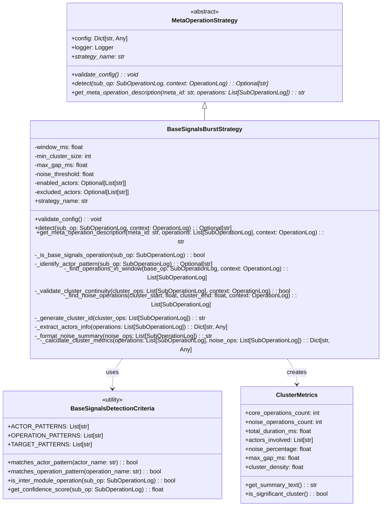

# Этап 2: Архитектура и проектирование

## Общая архитектура стратегии

Стратегия BaseSignalsMetaBurst реализует **специализированную детекцию всплесков межмодульных операций** через BaseSignals механизм. Архитектура следует паттерну **Strategy** и интегрируется в существующую систему мета-операций без нарушения принципов **Open/Closed Principle**.

### Место в архитектуре системы

```mermaid
graph TB
    subgraph "Meta-Operation Detection System"
        MOD[MetaOperationDetector] 
        MOS[MetaOperationStrategy]
    end
    
    subgraph "Existing Strategies"
        TWS[TimeWindowStrategy]
        TCS[TargetClusterStrategy] 
        NSS[NameSimilarityStrategy]
        SCS[SequenceCountStrategy]
    end
    
    subgraph "New Strategy"
        BSBS[BaseSignalsBurstStrategy]
    end
    
    subgraph "Data Structures"
        SOL[SubOperationLog]
        OL[OperationLog]
        MO[MetaOperation]
    end
    
    MOD --> MOS
    MOS <|-- TWS
    MOS <|-- TCS
    MOS <|-- NSS
    MOS <|-- SCS
    MOS <|-- BSBS
    
    BSBS --> SOL
    BSBS --> OL
    BSBS --> MO
```

## UML класс-диаграмма BaseSignalsBurstStrategy



## Архитектура детекции BaseSignals операций

### Критерии идентификации BaseSignals операций

**Проблема**: Отсутствие прямого поля `source_module` в `SubOperationLog` требует косвенной идентификации операций, инициированных BaseSignals механизмом.

**Решение**: Многокритериальная система идентификации:

#### 1. Паттерны actor_name (первичный критерий)
```python
KNOWN_BASE_SIGNALS_ACTORS = {
    "main_window", "calculations_data_operations", "calculations_data",
    "file_data", "series_data", "calculations", "model_fit_calculation", 
    "model_free_calculation", "active_file_operations"
}

def _is_base_signals_actor(self, operation_name: str, target: str) -> bool:
    """Check if operation originates from BaseSignals actor."""
    # Direct actor matching
    if target in self.KNOWN_BASE_SIGNALS_ACTORS:
        return True
    
    # Pattern-based matching for dynamic actors
    return any(pattern in target for pattern in ["_calculation", "_data", "_operations"])
```

#### 2. Операционные паттерны (вторичный критерий)  
```python
BASE_SIGNALS_OPERATION_PATTERNS = {
    # Core BaseSignals operations
    "handle_request_cycle", "create_and_emit_request", "process_request", "process_response",
    
    # Inter-module communication operations  
    "GET_VALUE", "SET_VALUE", "UPDATE_VALUE", "LOAD_FILE", "PLOT_DF",
    "MODEL_FIT_CALCULATION", "MODEL_FREE_CALCULATION", "DECONVOLUTION",
    
    # Data flow operations
    "get_df_data", "get_series_value", "update_series", "add_reaction"
}

def _matches_operation_pattern(self, operation_name: str) -> bool:
    """Check if operation name matches BaseSignals patterns."""
    if operation_name in self.BASE_SIGNALS_OPERATION_PATTERNS:
        return True
    
    # Pattern matching for OperationType enum values
    return any(pattern in operation_name.upper() for pattern in ["GET_", "SET_", "UPDATE_", "LOAD_", "PLOT_"])
```

#### 3. Временные паттерны (поддерживающий критерий)
```python
def _has_base_signals_timing_pattern(self, sub_op: SubOperationLog, context: OperationLog) -> bool:
    """Check for timing patterns characteristic of BaseSignals operations."""
    # BaseSignals operations typically have short execution times (< 10ms)
    if sub_op.execution_time and sub_op.execution_time > 0.01:  # 10ms
        return False
    
    # Check for clustered timing (multiple operations in rapid succession)
    nearby_ops = [op for op in context.sub_operations 
                 if op.start_time and sub_op.start_time and 
                 abs(op.start_time - sub_op.start_time) < 0.05]  # 50ms window
    
    return len(nearby_ops) >= 2
```

### Составной алгоритм идентификации

```python
def _is_base_signals_operation(self, sub_op: SubOperationLog) -> bool:
    """Comprehensive BaseSignals operation identification."""
    confidence_score = 0
    
    # Primary criteria (high confidence)
    if self._is_base_signals_actor(sub_op.operation_name, sub_op.target):
        confidence_score += 0.6
    
    # Secondary criteria (medium confidence)  
    if self._matches_operation_pattern(sub_op.operation_name):
        confidence_score += 0.3
    
    # Supporting criteria (low confidence)
    if self._has_base_signals_timing_pattern(sub_op, context):
        confidence_score += 0.1
    
    # Confidence threshold for classification
    return confidence_score >= 0.5
```

## Детальный алгоритм детекции кластеров

### Основной алгоритм метода `detect`

```python
def detect(self, sub_op: SubOperationLog, context: OperationLog) -> Optional[str]:
    """
    Detect BaseSignals burst clusters.
    
    Algorithm:
    1. Verify operation is BaseSignals-related
    2. Find all BaseSignals operations in time window
    3. Validate cluster continuity and size requirements
    4. Generate unique cluster identifier
    
    Returns:
        Optional[str]: Cluster ID if operation belongs to burst, None otherwise
    """
    
    # Step 1: Pre-filtering
    if not self._is_base_signals_operation(sub_op):
        return None
    
    # Step 2: Window-based operation discovery
    cluster_candidates = self._find_operations_in_window(sub_op, context)
    
    # Step 3: Cluster validation
    if not self._validate_cluster_requirements(cluster_candidates, context):
        return None
    
    # Step 4: Generate cluster identifier
    return self._generate_cluster_id(cluster_candidates)
```

### Алгоритм поиска операций в окне

```python
def _find_operations_in_window(self, base_op: SubOperationLog, context: OperationLog) -> List[SubOperationLog]:
    """Find all BaseSignals operations within time window."""
    if not base_op.start_time:
        return [base_op]
    
    window_start = base_op.start_time
    window_end = window_start + (self.window_ms / 1000.0)
    
    cluster_operations = []
    
    for op in context.sub_operations:
        if not op.start_time:
            continue
            
        # Check if operation is within time window
        if window_start <= op.start_time <= window_end:
            if self._is_base_signals_operation(op):
                cluster_operations.append(op)
    
    # Sort by start time for continuity analysis
    return sorted(cluster_operations, key=lambda x: x.start_time or 0)
```

### Валидация кластера

```python
def _validate_cluster_requirements(self, cluster_ops: List[SubOperationLog], context: OperationLog) -> bool:
    """Validate that cluster meets all requirements."""
    
    # Minimum size requirement
    if len(cluster_ops) < self.min_cluster_size:
        return False
    
    # Continuity validation (no gaps larger than max_gap_ms)
    if not self._validate_cluster_continuity(cluster_ops, context):
        return False
        
    # Actor diversity check (optional requirement)
    actors = {op.target for op in cluster_ops}
    if len(actors) < 2:  # Single-actor clusters may not be interesting
        return False
    
    return True

def _validate_cluster_continuity(self, cluster_ops: List[SubOperationLog], context: OperationLog) -> bool:
    """Check that gaps between cluster operations don't exceed max_gap_ms."""
    if len(cluster_ops) <= 1:
        return True
    
    max_gap_seconds = self.max_gap_ms / 1000.0
    
    for i in range(1, len(cluster_ops)):
        prev_op = cluster_ops[i-1]
        curr_op = cluster_ops[i]
        
        if prev_op.start_time and curr_op.start_time:
            gap = curr_op.start_time - prev_op.start_time
            if gap > max_gap_seconds:
                return False
    
    return True
```

## Архитектура обработки шумовых операций

### Стратегия неинвазивной детекции шума

**Решение**: Динамическое определение шумовых операций в методе `get_meta_operation_description` без модификации структуры `MetaOperation`.

```python
def _find_noise_operations(self, cluster_start: float, cluster_end: float, context: OperationLog) -> List[SubOperationLog]:
    """Find noise operations within cluster time boundaries."""
    noise_ops = []
    
    for op in context.sub_operations:
        if not op.start_time:
            continue
            
        # Check if operation overlaps with cluster timespan
        op_end = op.end_time or op.start_time
        
        if (cluster_start <= op.start_time <= cluster_end or 
            cluster_start <= op_end <= cluster_end or
            (op.start_time <= cluster_start and op_end >= cluster_end)):
            
            # If it's not a BaseSignals operation, it's noise
            if not self._is_base_signals_operation(op):
                noise_ops.append(op)
    
    return noise_ops

def _format_noise_summary(self, noise_ops: List[SubOperationLog]) -> str:
    """Format noise operations summary for description."""
    if not noise_ops:
        return ""
    
    noise_count = len(noise_ops)
    
    # Get unique operation types for summary
    noise_types = list({op.operation_name for op in noise_ops if op.operation_name})
    
    if len(noise_types) <= 2:
        types_str = ", ".join(noise_types)
        return f"noise: {noise_count} ops ({types_str})"
    else:
        return f"noise: {noise_count} ops ({noise_types[0]}, +{len(noise_types)-1} more)"
```

## Архитектура генерации описаний

### Компоненты мета-операционного резюме

```python
def get_meta_operation_description(self, meta_id: str, operations: List[SubOperationLog], context: OperationLog) -> str:
    """Generate comprehensive cluster description."""
    
    # Calculate cluster boundaries
    start_time = min(op.start_time for op in operations if op.start_time)
    end_time = max(op.end_time or op.start_time for op in operations if op.start_time)
    
    # Find noise operations
    noise_ops = self._find_noise_operations(start_time, end_time, context)
    
    # Extract metrics
    metrics = self._calculate_cluster_metrics(operations, noise_ops)
    
    # Generate description components
    return self._format_cluster_description(operations, metrics)

def _calculate_cluster_metrics(self, operations: List[SubOperationLog], noise_ops: List[SubOperationLog]) -> Dict[str, Any]:
    """Calculate comprehensive cluster metrics."""
    start_time = min(op.start_time for op in operations if op.start_time)
    end_time = max(op.end_time or op.start_time for op in operations if op.start_time)
    
    return {
        'core_operations_count': len(operations),
        'noise_operations_count': len(noise_ops),
        'total_duration_ms': (end_time - start_time) * 1000,
        'actors_involved': list({op.target for op in operations}),
        'noise_percentage': (len(noise_ops) / (len(operations) + len(noise_ops))) * 100 if operations else 0,
        'operation_types': list({op.operation_name for op in operations}),
        'cluster_density': len(operations) / ((end_time - start_time) * 1000) if end_time > start_time else 0
    }
```

### Форматы описаний

#### Компактный формат
```python
def _format_compact_description(self, operations: List[SubOperationLog], metrics: Dict[str, Any]) -> str:
    """Generate compact cluster description."""
    core_count = metrics['core_operations_count']
    duration_ms = metrics['total_duration_ms']
    noise_count = metrics['noise_operations_count']
    
    base_desc = f"BaseSignals burst: {core_count} ops in {duration_ms:.1f}ms"
    
    if noise_count > 0:
        noise_pct = metrics['noise_percentage']
        base_desc += f" (noise: {noise_pct:.0f}%)"
    
    return base_desc
```

#### Детальный формат
```python  
def _format_detailed_description(self, operations: List[SubOperationLog], metrics: Dict[str, Any]) -> str:
    """Generate detailed cluster description."""
    actors = ", ".join(metrics['actors_involved'][:3])
    if len(metrics['actors_involved']) > 3:
        actors += f", +{len(metrics['actors_involved'])-3} more"
    
    core_count = metrics['core_operations_count']
    duration_ms = metrics['total_duration_ms']
    noise_count = metrics['noise_operations_count']
    
    desc_parts = [
        f"BaseSignals burst: {core_count} operations in {duration_ms:.1f}ms",
        f"Actors: {actors}",
    ]
    
    if noise_count > 0:
        noise_pct = metrics['noise_percentage']
        desc_parts.append(f"Noise: {noise_count} ops ({noise_pct:.1f}%)")
    
    return " | ".join(desc_parts)
```

## Конфигурационная архитектура

### Структура конфигурации

```python
DEFAULT_CONFIG = {
    # Core timing parameters
    "window_ms": 100.0,           # Time window for clustering (ms)
    "min_cluster_size": 2,        # Minimum operations to form cluster
    "max_gap_ms": 50.0,          # Maximum gap between operations (ms)
    
    # Noise handling  
    "noise_threshold": 30.0,      # Max noise percentage for significant cluster
    "include_noise_in_summary": True,  # Whether to include noise info
    
    # Actor filtering
    "enabled_actors": None,       # Whitelist of actors (None = all enabled)
    "excluded_actors": [],        # Blacklist of actors
    
    # Performance tuning
    "max_window_operations": 50,  # Max operations to analyze in window
    "enable_timing_validation": True,  # Enable timing pattern validation
    
    # Output formatting
    "description_format": "compact",  # "compact" | "detailed" | "minimal"
    "include_actor_info": True,   # Include actor information in description
    "max_actors_in_summary": 3,   # Max actors to list in summary
}

def validate_config(self) -> None:
    """Validate all configuration parameters."""
    
    # Required parameters validation
    required_params = ["window_ms", "min_cluster_size"]
    for param in required_params:
        if param not in self.config:
            raise ValueError(f"BaseSignalsBurstStrategy missing required parameter: {param}")
    
    # Numeric parameters validation
    if self.config["window_ms"] <= 0:
        raise ValueError("window_ms must be positive")
    
    if self.config["min_cluster_size"] < 1:
        raise ValueError("min_cluster_size must be at least 1")
    
    # Optional parameters validation
    if "max_gap_ms" in self.config and self.config["max_gap_ms"] <= 0:
        raise ValueError("max_gap_ms must be positive")
    
    if "noise_threshold" in self.config:
        threshold = self.config["noise_threshold"]
        if not 0 <= threshold <= 100:
            raise ValueError("noise_threshold must be between 0 and 100")
```

## Архитектура интеграции с системой

### Регистрация в MetaOperationDetector

```python
# В MetaOperationConfig.STRATEGY_REGISTRY
STRATEGY_REGISTRY: Dict[str, Type[MetaOperationStrategy]] = {
    "time_window": TimeWindowStrategy,
    "name_similarity": NameSimilarityStrategy,
    "target_cluster": TargetClusterStrategy,
    "sequence_count": SequenceCountStrategy,
    "base_signals_burst": BaseSignalsBurstStrategy,  # Новая стратегия
}

# В MetaOperationConfig.DEFAULT_CONFIG
DEFAULT_CONFIG: Dict[str, Dict[str, Any]] = {
    # ...existing strategies...
    "base_signals_burst": {
        "window_ms": 100.0,
        "min_cluster_size": 2,
        "max_gap_ms": 50.0,
        "noise_threshold": 30.0,
    },
}
```

### Приоритизация стратегий

```python
# В MetaOperationConfig.PRESET_CONFIGS
"enhanced_clustering_with_base_signals": {
    "strategies": [
        {
            "name": "base_signals_burst",     # Высший приоритет
            "priority": 1,
            "params": {
                "window_ms": 100,
                "min_cluster_size": 2,
                "max_gap_ms": 50,
            },
        },
        {
            "name": "time_window",           # Вторичный приоритет
            "priority": 2,
            "params": {
                "window_ms": 50,
            },
        },
        {
            "name": "target_cluster",        # Третичный приоритет
            "priority": 3,
            "params": {
                "min_cluster_size": 2,
            },
        },
    ]
}
```

## Архитектура производительности

### Оптимизации алгоритмов

#### 1. Ленивая оценка операций
```python
def detect(self, sub_op: SubOperationLog, context: OperationLog) -> Optional[str]:
    """Optimized detection with early exits."""
    
    # Early exit for non-BaseSignals operations
    if not self._is_base_signals_operation(sub_op):
        return None
    
    # Early exit for insufficient context
    if len(context.sub_operations) < self.min_cluster_size:
        return None
    
    # Limit search scope for performance
    max_operations = self.config.get("max_window_operations", 50)
    if len(context.sub_operations) > max_operations:
        # Use time-bounded search instead of full context
        return self._detect_in_bounded_window(sub_op, context, max_operations)
    
    return self._detect_in_full_context(sub_op, context)
```

#### 2. Кэширование результатов идентификации
```python
class BaseSignalsBurstStrategy(MetaOperationStrategy):
    def __init__(self, config: Dict[str, Any]):
        super().__init__(config)
        self._identification_cache: Dict[str, bool] = {}
        self._cluster_cache: Dict[str, Optional[str]] = {}
    
    def _is_base_signals_operation(self, sub_op: SubOperationLog) -> bool:
        """Cached BaseSignals operation identification."""
        cache_key = f"{sub_op.operation_name}:{sub_op.target}"
        
        if cache_key not in self._identification_cache:
            self._identification_cache[cache_key] = self._compute_base_signals_classification(sub_op)
        
        return self._identification_cache[cache_key]
```

#### 3. Временная сложность оптимизации
```python
def _find_operations_in_window_optimized(self, base_op: SubOperationLog, context: OperationLog) -> List[SubOperationLog]:
    """Optimized window search with early termination."""
    if not base_op.start_time:
        return [base_op]
    
    window_end = base_op.start_time + (self.window_ms / 1000.0)
    cluster_operations = []
    
    # Sort operations by start_time for early termination
    sorted_operations = sorted(
        [op for op in context.sub_operations if op.start_time],
        key=lambda x: x.start_time
    )
    
    for op in sorted_operations:
        # Early termination: if operation starts after window, we're done
        if op.start_time > window_end:
            break
            
        if base_op.start_time <= op.start_time <= window_end:
            if self._is_base_signals_operation(op):
                cluster_operations.append(op)
    
    return cluster_operations
```

### Метрики производительности

```python
class PerformanceMetrics:
    """Performance monitoring for BaseSignalsBurstStrategy."""
    
    def __init__(self):
        self.detection_times = []
        self.cache_hits = 0
        self.cache_misses = 0
        self.operations_analyzed = 0
    
    def record_detection_time(self, time_ms: float):
        self.detection_times.append(time_ms)
    
    def get_average_detection_time(self) -> float:
        return sum(self.detection_times) / len(self.detection_times) if self.detection_times else 0
    
    def get_cache_hit_rate(self) -> float:
        total = self.cache_hits + self.cache_misses
        return self.cache_hits / total if total > 0 else 0
```

## Архитектура обработки ошибок

### Стратегия отказоустойчивости

```python
def detect(self, sub_op: SubOperationLog, context: OperationLog) -> Optional[str]:
    """Fault-tolerant detection with comprehensive error handling."""
    try:
        # Core detection logic
        return self._safe_detect(sub_op, context)
        
    except Exception as e:
        # Log error but don't break main logging flow
        self.logger.error(
            f"BaseSignalsBurstStrategy detection failed for operation "
            f"{sub_op.operation_name}: {e}", 
            exc_info=True
        )
        
        # Return None to indicate no clustering (fail-safe behavior)
        return None

def _safe_detect(self, sub_op: SubOperationLog, context: OperationLog) -> Optional[str]:
    """Core detection logic with input validation."""
    
    # Validate inputs
    if not sub_op:
        raise ValueError("sub_op cannot be None")
    
    if not context or not context.sub_operations:
        return None
    
    if not sub_op.operation_name or not sub_op.target:
        return None
    
    # Proceed with detection
    return self._perform_detection(sub_op, context)
```

### Валидация данных

```python
def _validate_sub_operation(self, sub_op: SubOperationLog) -> bool:
    """Validate sub-operation data integrity."""
    
    # Check required fields
    if not sub_op.operation_name or not sub_op.target:
        return False
    
    # Check timing data consistency
    if sub_op.start_time and sub_op.end_time:
        if sub_op.end_time < sub_op.start_time:
            self.logger.warning(f"Invalid timing data in operation {sub_op.operation_name}")
            return False
    
    # Check execution time consistency
    if sub_op.execution_time and sub_op.execution_time < 0:
        return False
    
    return True
```

## Тестируемость архитектуры

### Архитектура для unit testing

```python
class BaseSignalsBurstStrategy(MetaOperationStrategy):
    """Strategy with enhanced testability."""
    
    def __init__(self, config: Dict[str, Any], detection_criteria: Optional[BaseSignalsDetectionCriteria] = None):
        super().__init__(config)
        
        # Dependency injection for testing
        self.detection_criteria = detection_criteria or BaseSignalsDetectionCriteria()
        
        # Expose internal state for testing
        self._last_cluster_metrics = None
        self._last_noise_operations = None
    
    # Expose private methods for unit testing
    def _test_is_base_signals_operation(self, sub_op: SubOperationLog) -> bool:
        """Test accessor for BaseSignals operation identification."""
        return self._is_base_signals_operation(sub_op)
    
    def _test_find_operations_in_window(self, base_op: SubOperationLog, context: OperationLog) -> List[SubOperationLog]:
        """Test accessor for window-based operation discovery."""
        return self._find_operations_in_window(base_op, context)
```

### Mock-объекты для тестирования

```python
def create_test_sub_operation(
    operation_name: str,
    target: str, 
    start_time: float,
    end_time: Optional[float] = None,
    execution_time: Optional[float] = None
) -> SubOperationLog:
    """Factory for creating test SubOperationLog instances."""
    
    return SubOperationLog(
        step_number=1,
        operation_name=operation_name,
        target=target,
        start_time=start_time,
        end_time=end_time or start_time + 0.001,
        execution_time=execution_time or 0.001,
        status="OK",
        data_type="dict"
    )

def create_test_operation_log(sub_operations: List[SubOperationLog]) -> OperationLog:
    """Factory for creating test OperationLog instances."""
    
    return OperationLog(
        operation_name="test_operation",
        sub_operations=sub_operations,
        start_time=min(op.start_time for op in sub_operations if op.start_time) if sub_operations else None
    )
```

---

## Результаты этапа 2

### ✅ Завершенные компоненты архитектуры:

1. **UML класс-диаграмма** BaseSignalsBurstStrategy с полной спецификацией методов
2. **Алгоритм детекции** с многокритериальной идентификацией BaseSignals операций  
3. **Архитектура обработки шума** через неинвазивную динамическую детекцию
4. **Система конфигурации** с валидацией и значениями по умолчанию
5. **Интеграция с существующей системой** через MetaOperationDetector
6. **Оптимизации производительности** с кэшированием и ленивой оценкой
7. **Стратегия обработки ошибок** с отказоустойчивостью
8. **Архитектура тестируемости** с dependency injection

### 🎯 Ключевые архитектурные решения:

- **Многокритериальная идентификация**: Комбинация паттернов actor_name, операций и временных характеристик
- **Неинвазивная обработка шума**: Динамическое определение без модификации MetaOperation
- **Производительностно-ориентированный дизайн**: Кэширование, ранний выход, ограничение области поиска
- **Отказоустойчивость**: Comprehensive error handling без влияния на основное логирование

### 📋 Готовность к этапу 3:

Архитектура полностью спроектирована для интеграции в существующую систему. Следующий этап: **[Этап 3: Интеграция и конфигурация](stage_03_integration_configuration.md)** - детальное планирование интеграции с MetaOperationDetector и конфигурационной системой.

## Следующий этап

**Этап 3: Интеграция и конфигурация** - разработка механизмов интеграции стратегии в существующую систему и системы конфигурации.
