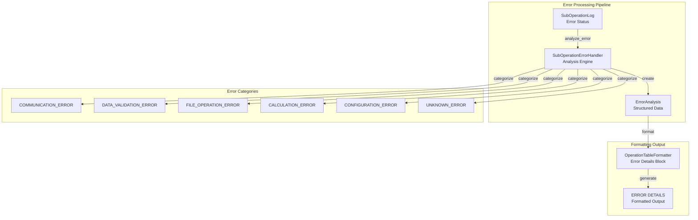

# Этап 4: Документация и финализация

**Проект:** Open ThermoKinetics - Анализ кинетики твердофазных реакций  
**Модуль:** `src/core/log_aggregator`  
**Этап:** 4 из 4  
**Продолжительность:** 1 день  
**Приоритет:** Средний  

## Цель этапа

Завершить проект корректировки системы агрегированного логирования операций: обновить документацию, провести финальные тесты и обеспечить готовность к production использованию.

## Задачи этапа

### 4.1 Обновление архитектурной документации

**Целевой файл:** `src/core/log_aggregator/LOG_AGGREGATOR_ARCHITECTURE.md`

**Требуемые обновления:**

1. **Добавить раздел "Система обработки ошибок":**
```markdown
## Архитектура системы обработки ошибок

### Компоненты системы ошибок

**SubOperationErrorHandler** - специализированный обработчик ошибок подопераций:
- Автоматическая категоризация ошибок по типам (Communication, Data Validation, File Operation, etc.)
- Определение уровня серьезности (Critical, High, Medium, Low)
- Извлечение контекстной информации для отладки
- Генерация предложений по устранению ошибок

**ErrorAnalysis** - структура данных для комплексного анализа ошибок:
- error_type: категоризированный тип ошибки
- error_message: человекочитаемое описание ошибки
- error_context: контекстная информация для отладки
- severity: уровень серьезности ошибки
- suggested_action: рекомендации по устранению
- technical_details: техническая информация для разработчиков
```

2. **Обновить раздел "Архитектура форматирования и вывода":**
```markdown
### Расширенный формат логирования

**Блок детальных ошибок**:
При наличии подопераций со статусом "Error" добавляется специальный блок ERROR DETAILS с:
- Пошаговым описанием каждой ошибки
- Категоризацией и уровнем серьезности
- Контекстной информацией для отладки
- Техническими деталями и предложениями по исправлению

**Конфигурируемость вывода**:
- include_error_details: включение/отключение детальных блоков ошибок
- max_error_context_items: ограничение количества контекстных элементов
- Возможность настройки уровня детализации для production/development
```

3. **Добавить диаграмму архитектуры обработки ошибок:**


### 4.2 Создание руководства пользователя

**Новый файл:** `src/core/log_aggregator/USER_GUIDE.md`

**Содержание руководства:**

```markdown
# Руководство пользователя: Система агрегированного логирования

## Быстрый старт

### Базовое использование
```python
from src.core.log_aggregator import operation

@operation
def your_business_method(self, param1, param2):
    """Your method with automatic operation logging."""
    # Все handle_request_cycle вызовы автоматически отслеживаются
    result = self.handle_request_cycle("target", "OPERATION_TYPE", **kwargs)
    return result
```

### Конфигурация детализации ошибок
```python
from src.core.log_aggregator import AggregatedOperationLogger

# Включить детальное логирование ошибок (по умолчанию)
logger = AggregatedOperationLogger(include_error_details=True)

# Отключить для production (для экономии места)
logger = AggregatedOperationLogger(include_error_details=False)
```

## Интерпретация логов

### Формат стандартного лога
[Примеры и описание стандартного формата]

### Формат расширенного лога с ошибками
[Примеры и описание расширенного формата с ERROR DETAILS блоком]

### Категории ошибок и их значение
[Описание каждой категории ошибок с примерами]

## Настройка и конфигурация
[Подробное описание всех конфигурационных параметров]

## Устранение проблем
[FAQ и решения типичных проблем]
```

### 4.3 Создание примеров использования

**Новый файл:** `docs/develop_plan/log_aggregator_examples.md`

**Примеры для разных сценариев:**

1. **Пример успешной операции:**
```python
# Код и соответствующий лог
```

2. **Пример операции с ошибками:**
```python
# Код и соответствующий лог с ERROR DETAILS
```

3. **Пример настройки конфигурации:**
```python
# Различные варианты конфигурации
```

### 4.4 Обновление docstrings

**Обновить документацию в коде для всех измененных файлов:**

1. **`error_handler.py`** - полные docstrings для всех классов и методов
2. **`sub_operation_log.py`** - обновленные docstrings с описанием новых полей
3. **`table_formatter.py`** - описание новых методов форматирования
4. **`aggregated_operation_logger.py`** - описание конфигурационных параметров

### 4.5 Создание migration guide

**Новый файл:** `src/core/log_aggregator/MIGRATION_GUIDE.md`

**Руководство по миграции для существующих пользователей:**

```markdown
# Руководство по миграции v1.0 → v1.1

## Изменения в API

### Обратно совместимые изменения
- Все существующие декораторы @operation продолжают работать без изменений
- Формат стандартных логов остался прежним
- Никаких breaking changes в публичном API

### Новая функциональность
- Автоматический анализ ошибок подопераций
- Детальные блоки ERROR DETAILS в логах
- Конфигурируемая детализация вывода

### Рекомендации по обновлению
1. Обновите импорты для использования новых классов ошибок (опционально)
2. Настройте уровень детализации для production/development
3. Ознакомьтесь с новыми категориями ошибок для лучшей диагностики

## Примеры миграции
[Конкретные примеры изменений в коде]
```

## Тестирование

### 4.6 Финальное комплексное тестирование

**Тестовые сценарии:**

1. **Regression тестирование:**
   - Все существующие тесты должны проходить
   - Проверка совместимости с существующим кодом
   - Тестирование на реальных данных из `logs/aggregated_operations.log`

2. **Performance тестирование:**
   - Измерение накладных расходов новой системы ошибок
   - Сравнение времени выполнения до/после изменений
   - Тестирование на больших объемах логов

3. **Integration тестирование:**
   - Тестирование всей цепочки: операция → анализ ошибки → форматирование → вывод
   - Проверка различных сценариев ошибок
   - Тестирование конфигурационных параметров

### 4.7 Создание демонстрационного скрипта

**Новый файл:** `tests/test_log_aggregator/demo_error_logging.py`

```python
"""
Демонстрационный скрипт для показа возможностей
расширенной системы логирования ошибок.
"""

def demo_successful_operation():
    """Демонстрация логирования успешной операции."""
    
def demo_operation_with_errors():
    """Демонстрация логирования операции с ошибками."""
    
def demo_different_error_categories():
    """Демонстрация различных категорий ошибок."""
    
def demo_configuration_options():
    """Демонстрация конфигурационных возможностей."""

if __name__ == "__main__":
    # Запуск всех демонстраций
    pass
```

### 4.8 Code review и финальная проверка

**Чек-лист для code review:**

- ✅ Соответствие архитектурным принципам проекта
- ✅ Качество кода и следование стандартам
- ✅ Полнота и корректность документации
- ✅ Покрытие тестами всей новой функциональности
- ✅ Производительность в пределах допустимых значений
- ✅ Обратная совместимость с существующим кодом
- ✅ Отсутствие memory leaks и ресурсных проблем

## Критерии завершения этапа

- ✅ `LOG_AGGREGATOR_ARCHITECTURE.md` обновлена с описанием системы ошибок
- ✅ `USER_GUIDE.md` создано с полным руководством пользователя
- ✅ `MIGRATION_GUIDE.md` создано для пользователей v1.0
- ✅ `log_aggregator_examples.md` создано с практическими примерами
- ✅ Все docstrings в коде обновлены и актуальны
- ✅ Демонстрационный скрипт создан и работает
- ✅ Все regression тесты проходят
- ✅ Performance тестирование завершено успешно
- ✅ Integration тестирование завершено
- ✅ Code review пройден
- ✅ Проект готов к production использованию

## Файлы для создания/изменения

### Новые файлы:
1. `src/core/log_aggregator/USER_GUIDE.md` - руководство пользователя
2. `src/core/log_aggregator/MIGRATION_GUIDE.md` - руководство по миграции
3. `docs/develop_plan/log_aggregator_examples.md` - примеры использования
4. `tests/test_log_aggregator/demo_error_logging.py` - демонстрационный скрипт

### Обновляемые файлы:
1. `src/core/log_aggregator/LOG_AGGREGATOR_ARCHITECTURE.md` - архитектурная документация
2. Все измененные `.py` файлы - обновление docstrings
3. `README.md` проекта - краткое описание новой функциональности

## Deliverables

По завершении этапа будут готовы:

1. **Полностью функциональная система** с расширенной обработкой ошибок
2. **Комплексная документация** для пользователей и разработчиков  
3. **Migration guide** для безболезненного обновления
4. **Примеры использования** для быстрого старта
5. **Демонстрационные материалы** для презентации возможностей
6. **Полное тестовое покрытие** новой функциональности

## Критерии quality gate

- **Функциональность**: 100% требований реализовано
- **Качество кода**: Code review пройден без критических замечаний
- **Тестирование**: Покрытие новой функциональности ≥ 80%
- **Производительность**: Накладные расходы ≤ 5% от baseline
- **Документация**: Полнота и актуальность документации подтверждена
- **Совместимость**: 100% backward compatibility обеспечена

## Заключение

После завершения Этапа 4 система агрегированного логирования операций будет полностью готова к production использованию с расширенными возможностями анализа и диагностики ошибок.
