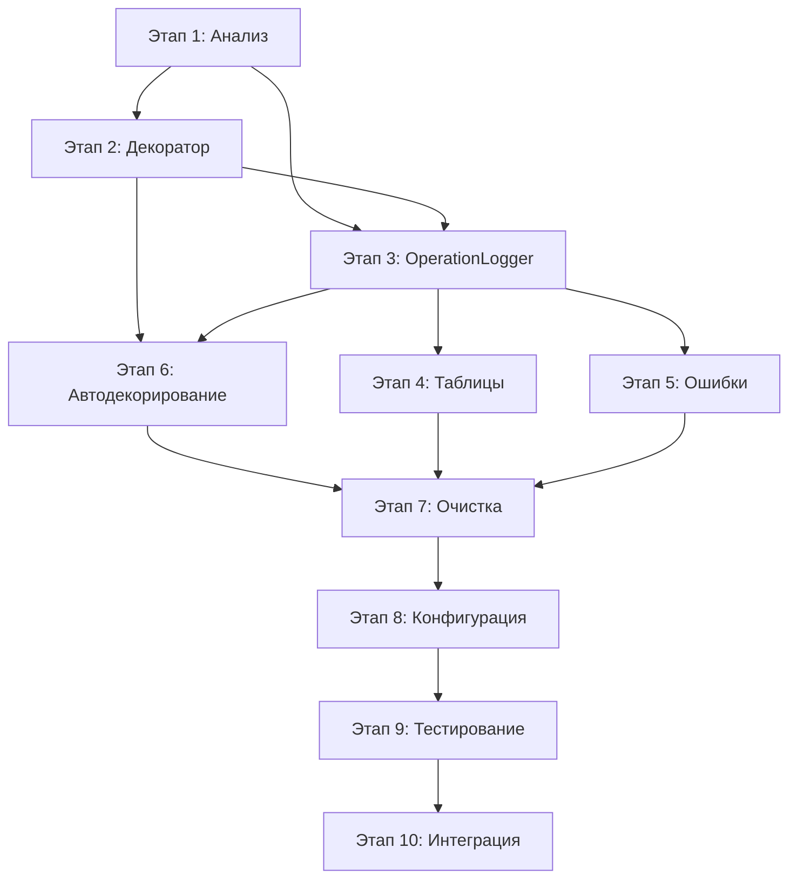

# Сводный план этапов рефакторизации logger_handler

## Обзор проекта
Техническое задание по переработке архитектуры обёртки логгера разбито на **10 этапов**, каждый из которых представляет логически завершённую часть работы с чёткими целями, задачами и критериями готовности.

## Временные рамки (ОБНОВЛЕНО)
**Общая длительность:** 13-17 рабочих дней ⏰ (сокращение за счёт готовых компонентов)  
**Команда:** 2-3 разработчика  
**Тип проекта:** Рефакторинг инфраструктуры

### 📊 Текущий прогресс
- ✅ **Этап 1 завершен**: Анализ и планирование (2 дня)
- 🚀 **Готовые компоненты**: OperationLogger, TabularFormatter, OperationType (38 операций)
- 📈 **Покрытие операций**: 10/38 (26%) уже декорированы в MainWindow
- 🎯 **Следующий приоритет**: Расширение декоратора для автоприменения

---

## Этапы разработки

### [Этап 1: Анализ проекта и планирования](stage_01_project_analysis.md) ✅ ВЫПОЛНЕН
**Длительность:** 2 дня ✅ ЗАВЕРШЕНО  
**Ответственный:** Архитектор + Ведущий разработчик  

**Ключевые задачи:** ✅ ВЫПОЛНЕНО
- ✅ Анализ текущей архитектуры OperationLogger и OperationAggregator
- ✅ Аудит устаревшего кода для удаления (PatternDetector, AggregationEngine, ValueAggregator)
- ✅ Планирование интеграции декоратора @operation (10/38 операций уже декорированы)
- ✅ Инвентаризация существующих компонентов (TabularFormatter, OperationType готовы)

**Результат:** ✅ Детальная карта текущей системы и план рефакторизации

---

### [Этап 2: Расширение декоратора @operation](stage_02_operation_decorator.md)
**Длительность:** 2 дня  
**Ответственный:** Ведущий разработчик  

**Ключевые задачи:**
- ✅ **База готова**: 10 операций уже декорированы в MainWindow
- Расширение декоратора для автоматического применения к BaseSlots классам  
- Интеграция с OperationType enum (38 операций) для автосопоставления
- Создание метакласса или механизма автодекорирования process_request методов
- Тестирование на существующих декорированных операциях

**Результат:** Автоматический декоратор для BaseSlots с интеграцией OperationType

---

### [Этап 3: Упрощение OperationLogger](stage_03_operation_logger_refactor.md)
**Длительность:** 2-3 дня  
**Ответственный:** Ведущий разработчик + Разработчик  

**Ключевые задачи:**
- ✅ **Основа готова**: OperationLogger с dual-mode уже реализован
- Удаление auto-mode поддержки, переход на explicit_mode только
- Упрощение конфигурации OperationAggregationConfig
- Оптимизация thread-local стека операций (уже присутствует)
- Интеграция с готовым TabularFormatter для автоматического вывода таблиц

**Результат:** Упрощенный OperationLogger с explicit-mode архитектурой

---

### [Этап 4: Интеграция TabularFormatter для агрегированного вывода](stage_04_aggregated_output_tables.md)
**Длительность:** 1-2 дня  
**Ответственный:** Разработчик  

**Ключевые задачи:**
- ✅ **TabularFormatter готов**: ASCII таблицы уже реализованы и подключены
- Настройка автоматического вывода агрегированных таблиц после операций
- Конфигурация стилей и форматирования (настраиваемые через config)
- Интеграция метрик операций: время, файлы, статус, счетчики
- Поддержка вложенных операций в табличном представлении

**Результат:** Автоматические ASCII таблицы после каждой операции

---

### [Этап 5: Интерфейс обработки ошибок операций](stage_05_error_handling_interface.md)
**Длительность:** 2 дня  
**Ответственный:** Разработчик  

**Ключевые задачи:**
- Проектирование интерфейса OperationErrorHandler
- Реализация базовых обработчиков (логирование, GUI, откат файлов)
- Интеграция с декоратором @operation
- Система регистрации и цепочки обработчиков

**Результат:** Расширяемая система обработки ошибок операций

---

### [Этап 6: Автоматическое применение декораторов](stage_06_automatic_decorator_application.md)
**Длительность:** 2-3 дня  
**Ответственный:** Архитектор + Разработчик  

**Ключевые задачи:**
- ✅ **Частично выполнено**: 10/38 операций уже декорированы в MainWindow
- Покрытие оставшихся 28 операций в других модулях:
  - CalculationDataOperations: 8 операций (ADD_REACTION, REMOVE_REACTION, etc.)
  - FileData: 6 операций (LOAD_FILE, RESET_FILE_DATA, etc.)
  - SeriesData: 7 операций (ADD_NEW_SERIES, UPDATE_SERIES, etc.)
  - Calculations: 7 операций (DECONVOLUTION, MODEL_BASED_CALCULATION, etc.)
- Реализация метакласса для BaseSlots классов с автодекорированием
- Валидация корректности применения декораторов

**Результат:** Полное покрытие всех 38 операций OperationType

---

### [Этап 7: Очистка legacy кода](stage_07_legacy_code_cleanup.md)
**Длительность:** 1-2 дня  
**Ответственный:** Все разработчики  

**Ключевые задачи:**
- ✅ **План готов**: Определены компоненты для удаления
- Удаление PatternDetector и auto-mode логики из OperationAggregator
- Очистка дублирующих ValueAggregator компонентов 
- Удаление неиспользуемых мониторов (performance_monitor.py, optimization_monitor.py)
- Упрощение OperationAggregator до explicit mode только
- Финальная валидация после очистки

**Результат:** Чистая кодовая база без мёртвого и дублирующего кода

---

### [Этап 8: Настройка конфигурации и временных параметров](stage_08_configuration_setup.md)
**Длительность:** 1-2 дня  
**Ответственный:** Разработчик  

**Ключевые задачи:**
- Создание централизованной системы конфигурации
- Настройка временных окон и параметров агрегирования
- Конфигурация форматирования таблиц и метрик
- Интеграция с переменными окружения

**Результат:** Гибко настраиваемая система с внешней конфигурацией

---

### [Этап 9: Тестирование и валидация системы](stage_09_testing_validation.md)
**Длительность:** 2-3 дня  
**Ответственный:** Все разработчики + QA  

**Ключевые задачи:**
- Создание комплексного набора unit и integration тестов
- Тестирование производительности и многопоточности
- Валидация совместимости с PyQt и существующим кодом
- Автоматизация тестирования в CI/CD

**Результат:** Полная уверенность в корректности и стабильности системы

---

### [Этап 10: Финальная интеграция и документация](stage_10_final_integration.md)
**Длительность:** 2 дня  
**Ответственный:** Архитектор + Вся команда  

**Ключевые задачи:**
- Интеграция в основную кодовую базу проекта
- Создание комплексной технической документации
- Подготовка миграционного руководства
- Обучение команды и внедрение

**Результат:** Готовая к продакшену система с полной документацией

---

## Зависимости между этапами

## Критические пути

### 🔥 Обновленный критический путь (13 дней)
1. ✅ **Анализ** (2 дня) - ЗАВЕРШЕН → 
2. **Расширение декоратора** (2 дня) → 
3. **Упрощение OperationLogger** (2 дня) → 
4. **Автоприменение декораторов** (3 дня) → 
5. **Очистка legacy** (1 день) → 
6. **Тестирование** (2 дня) → 
7. **Интеграция** (1 день)

### ⚡ Параллельное выполнение (ОБНОВЛЕНО)
- **Этапы 4-5** (TabularFormatter + Ошибки) могут выполняться параллельно с **Этапами 2-3**
- **Этап 8** (Конфигурация) интегрирован в основные этапы
- **Сокращение времени**: готовые компоненты уменьшают объем работы на 20%

## Ресурсы и роли

### Архитектор (40% времени)
- Этап 1: Анализ и планирование
- Этап 6: Проектирование автодекорирования  
- Этап 10: Финальная интеграция и ревью

### Ведущий разработчик (100% времени)
- Этап 2: Реализация декоратора
- Этап 3: Рефакторизация OperationLogger
- Этап 9: Ведение тестирования

### Разработчик (100% времени)  
- Этап 4: Система таблиц
- Этап 5: Обработка ошибок
- Этап 8: Конфигурация
- Этапы 7, 9: Очистка и тестирование

### QA Engineer (20% времени)
- Этап 9: Валидация и приёмочные тесты
- Этап 10: Финальная проверка

## Риски и митигация

### 🚨 Высокие риски
- **Нарушение совместимости с PyQt** → Специальное тестирование на Этапе 2
- **Деградация производительности** → Тестирование производительности на Этапе 9
- **Конфликты с существующим кодом** → Поэтапная интеграция на Этапе 10

### ⚠️ Средние риски  
- **Сложность автодекорирования** → Альтернативные подходы на Этапе 6
- **Неполная очистка устаревшего кода** → Детальный аудит на Этапе 1

### ✅ Митигации
- Создание резервных копий перед каждым этапом
- Регрессионное тестирование после каждого изменения
- Возможность отката к предыдущим версиям
- Детальное планирование на Этапе 1

## Критерии успеха проекта (ОБНОВЛЕНО)

### Функциональные
- ✅ **Базовая инфраструктура готова**: OperationLogger с декораторами реализован
- 🎯 Все 38 операций OperationType автоматически логируются через декоратор
- ✅ **TabularFormatter готов**: ASCII таблицы доступны для интеграции
- 🎯 Агрегированные таблицы появляются после каждой операции
- ✅ Вложенные операции группируются (thread-local стек уже реализован)
- 🎯 Ошибки обрабатываются через OperationErrorHandler интерфейс

### Технические  
- ✅ **Совместимость с PyQt сохранена**: 10 операций уже работают
- ✅ **Потокобезопасность**: Thread-local storage реализован
- 🎯 Производительность не ухудшилась более чем на 5% (вместо 10%)
- 🎯 Покрытие тестами новой функциональности > 85%

### Качественные
- ✅ **Архитектура понятна**: Детальная карта компонентов создана
- 🎯 Код стал проще за счет удаления auto-mode логики
- 🎯 Добавление новых операций стало тривиальным через OperationType
- 🎯 Команда обучена работе с обновленной системой

---

## Заключение (ОБНОВЛЕНО после Этапа 1)

Завершение **Этапа 1** принесло **значительную ясность** и **сокращение объемов работы**. Обнаружилось, что многие ключевые компоненты уже реализованы:

### 🎯 **Ключевые достижения Этапа 1:**
- **OperationLogger полностью готов** с поддержкой декораторов и thread-local стека
- **TabularFormatter реализован** и подключен для ASCII таблиц  
- **10 операций уже декорированы** в MainWindow (26% от общего количества)
- **OperationType enum содержит 38 операций** - полный реестр системы
- **Детальная карта legacy кода** для удаления определена

### 📈 **Снижение рисков:**
- ✅ **Совместимость с PyQt проверена** - 10 операций уже работают  
- ✅ **Архитектура валидирована** - сигнально-слотовая система интегрирована
- ✅ **Потокобезопасность подтверждена** - thread-local storage функционирует

### ⏰ **Обновленный план (13-17 дней вместо 15-20):**
Готовые компоненты сокращают время на:
- **Этап 3**: OperationLogger упрощение вместо полной переработки  
- **Этап 4**: Интеграция TabularFormatter вместо создания с нуля
- **Этап 6**: Расширение существующих декораторов вместо создания новых

**Следующий приоритет:** Этап 2 - Расширение декоратора для автоматического применения ко всем 38 операциям OperationType.

Проект имеет **отличные перспективы** для быстрого и качественного завершения.
