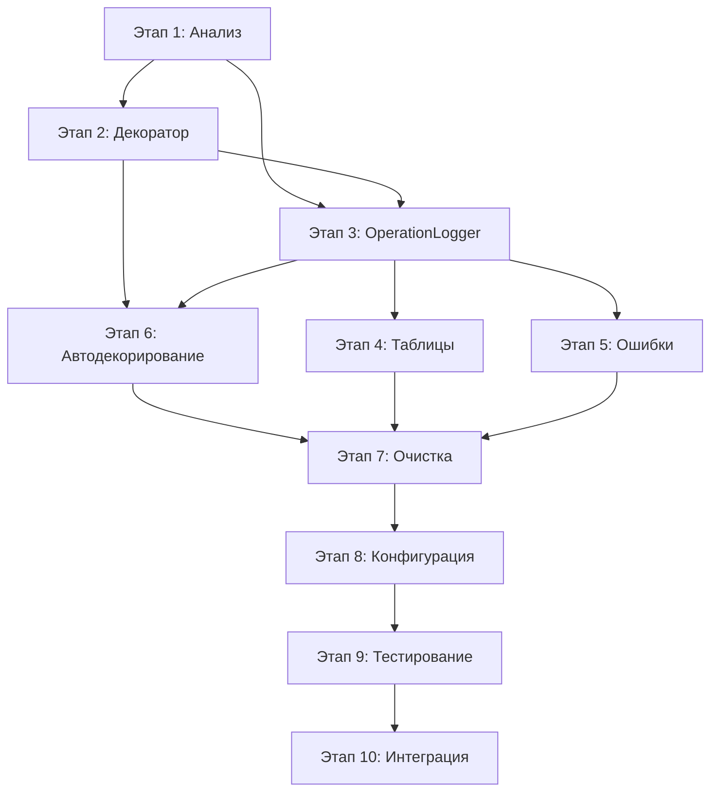

# Сводный план этапов рефакторизации logger_handler

## Обзор проекта
Техническое задание по переработке архитектуры обёртки логгера разбито на **10 этапов**, каждый из которых представляет логически завершённую часть работы с чёткими целями, задачами и критериями готовности.

## Временные рамки
**Общая длительность:** 15-20 рабочих дней  
**Команда:** 2-3 разработчика  
**Тип проекта:** Рефакторинг инфраструктуры

---

## Этапы разработки

### [Этап 1: Анализ проекта и планирование](stage_01_project_analysis.md)
**Длительность:** 2 дня  
**Ответственный:** Архитектор + Ведущий разработчик  

**Ключевые задачи:**
- Анализ текущей архитектуры OperationLogger и OperationAggregator
- Аудит устаревшего кода для удаления
- Планирование интеграции декоратора @operation
- Инвентаризация существующих компонентов

**Результат:** Детальная карта текущей системы и план рефакторизации

---

### [Этап 2: Создание нового декоратора @operation](stage_02_operation_decorator.md)
**Длительность:** 2 дня  
**Ответственный:** Ведущий разработчик  

**Ключевые задачи:**
- Реализация базового декоратора с интеграцией в OperationLogger
- Обработка исключений и вложенных операций
- Сохранение совместимости с PyQt декораторами
- Базовое тестирование функциональности

**Результат:** Рабочий декоратор @operation с поддержкой основных сценариев

---

### [Этап 3: Рефакторизация OperationLogger](stage_03_operation_logger_refactor.md)
**Длительность:** 2-3 дня  
**Ответственный:** Ведущий разработчик + Разработчик  

**Ключевые задачи:**
- Упрощение API OperationLogger для работы с декораторами
- Реализация thread-local стека операций
- Система автоматического сбора метрик
- Интеграция с агрегированным выводом

**Результат:** Обновлённый OperationLogger с поддержкой декораторной архитектуры

---

### [Этап 4: Система агрегированного вывода таблиц](stage_04_aggregated_output_tables.md)
**Длительность:** 2 дня  
**Ответственный:** Разработчик  

**Ключевые задачи:**
- Интеграция библиотеки Rich для профессионального форматирования таблиц
- Создание структуры метрик операций (базовые, файловые, доменные)
- Настраиваемые Rich стили и темы оформления
- Панели ошибок и расширенные возможности форматирования

**Результат:** Система красивого Rich вывода метрик операций с поддержкой цветов и Unicode

---

### [Этап 5: Интерфейс обработки ошибок операций](stage_05_error_handling_interface.md)
**Длительность:** 2 дня  
**Ответственный:** Разработчик  

**Ключевые задачи:**
- Проектирование интерфейса OperationErrorHandler
- Реализация базовых обработчиков (логирование, GUI, откат файлов)
- Интеграция с декоратором @operation
- Система регистрации и цепочки обработчиков

**Результат:** Расширяемая система обработки ошибок операций

---

### [Этап 6: Автоматическое применение декораторов](stage_06_automatic_decorator_application.md)
**Длительность:** 2-3 дня  
**Ответственный:** Архитектор + Разработчик  

**Ключевые задачи:**
- Реализация метакласса или __init_subclass__ для автодекорирования
- Создание карты операций OperationType → методы
- Валидация корректности применения декораторов
- Сохранение PyQt совместимости

**Результат:** Автоматическое декорирование всех операций без ручной работы

---

### [Этап 7: Очистка устаревшего кода](stage_07_legacy_code_cleanup.md)
**Длительность:** 1-2 дня  
**Ответственный:** Все разработчики  

**Ключевые задачи:**
- Удаление логики автоматического обнаружения операций
- Очистка ValueAggregator и устаревших классов агрегации
- Упрощение OperationAggregator до explicit mode
- Финальная валидация после очистки

**Результат:** Чистая кодовая база без мёртвого и дублирующего кода

---

### [Этап 8: Настройка конфигурации и временных параметров](stage_08_configuration_setup.md)
**Длительность:** 1-2 дня  
**Ответственный:** Разработчик  

**Ключевые задачи:**
- Создание централизованной системы конфигурации
- Настройка временных окон и параметров агрегирования
- Конфигурация форматирования таблиц и метрик
- Интеграция с переменными окружения

**Результат:** Гибко настраиваемая система с внешней конфигурацией

---

### [Этап 9: Тестирование и валидация системы](stage_09_testing_validation.md)
**Длительность:** 2-3 дня  
**Ответственный:** Все разработчики + QA  

**Ключевые задачи:**
- Создание комплексного набора unit и integration тестов
- Тестирование производительности и многопоточности
- Валидация совместимости с PyQt и существующим кодом
- Автоматизация тестирования в CI/CD

**Результат:** Полная уверенность в корректности и стабильности системы

---

### [Этап 10: Финальная интеграция и документация](stage_10_final_integration.md)
**Длительность:** 2 дня  
**Ответственный:** Архитектор + Вся команда  

**Ключевые задачи:**
- Интеграция в основную кодовую базу проекта
- Создание комплексной технической документации
- Подготовка миграционного руководства
- Обучение команды и внедрение

**Результат:** Готовая к продакшену система с полной документацией

---

## Зависимости между этапами

## Критические пути

### 🔥 Критический путь (15 дней)
1. **Анализ** (2 дня) → 
2. **Декоратор** (2 дня) → 
3. **OperationLogger** (3 дня) → 
4. **Автодекорирование** (3 дня) → 
5. **Очистка** (1 день) → 
6. **Тестирование** (2 дня) → 
7. **Интеграция** (2 дня)

### ⚡ Параллельное выполнение
- **Этапы 4-5** (Таблицы + Ошибки) могут выполняться параллельно с **Этапом 6** (Автодекорирование)
- **Этап 8** (Конфигурация) может выполняться параллельно с **Этапом 7** (Очистка)

## Ресурсы и роли

### Архитектор (40% времени)
- Этап 1: Анализ и планирование
- Этап 6: Проектирование автодекорирования  
- Этап 10: Финальная интеграция и ревью

### Ведущий разработчик (100% времени)
- Этап 2: Реализация декоратора
- Этап 3: Рефакторизация OperationLogger
- Этап 9: Ведение тестирования

### Разработчик (100% времени)  
- Этап 4: Система таблиц
- Этап 5: Обработка ошибок
- Этап 8: Конфигурация
- Этапы 7, 9: Очистка и тестирование

### QA Engineer (20% времени)
- Этап 9: Валидация и приёмочные тесты
- Этап 10: Финальная проверка

## Риски и митигация

### 🚨 Высокие риски
- **Нарушение совместимости с PyQt** → Специальное тестирование на Этапе 2
- **Деградация производительности** → Тестирование производительности на Этапе 9
- **Конфликты с существующим кодом** → Поэтапная интеграция на Этапе 10

### ⚠️ Средние риски  
- **Сложность автодекорирования** → Альтернативные подходы на Этапе 6
- **Неполная очистка устаревшего кода** → Детальный аудит на Этапе 1

### ✅ Митигации
- Создание резервных копий перед каждым этапом
- Регрессионное тестирование после каждого изменения
- Возможность отката к предыдущим версиям
- Детальное планирование на Этапе 1

## Критерии успеха проекта

### Функциональные
- ✅ Все операции автоматически логируются через декоратор
- ✅ Rich таблицы с красивым форматированием появляются после каждой операции
- ✅ Вложенные операции корректно группируются
- ✅ Ошибки обрабатываются и отображаются в Rich панелях
- ✅ Поддержка цветов, Unicode символов и экспорта в HTML/SVG

### Технические  
- ✅ Производительность не ухудшилась более чем на 10%
- ✅ Покрытие тестами новой функциональности > 90%
- ✅ Совместимость с PyQt сохранена
- ✅ Потокобезопасность обеспечена

### Качественные
- ✅ Код стал проще и понятнее
- ✅ Добавление новых операций стало тривиальным
- ✅ Команда обучена работе с новой системой
- ✅ Документация полная и актуальная

---

## Заключение

Данный план обеспечивает **структурированный подход** к рефакторизации сложной системы логирования с **минимизацией рисков** и **максимальным контролем качества**. 

Каждый этап имеет **чёткие входные и выходные критерии**, что позволяет легко отслеживать прогресс и принимать решения о переходе к следующему этапу.

**Ключевые преимущества плана:**
- Поэтапная валидация без накопления технического долга
- Возможность параллельного выполнения независимых частей
- Детальная проработка сложных аспектов (автодекорирование, PyQt совместимость)
- Комплексное покрытие тестами и документацией

**Ожидаемый результат:** Современная, расширяемая и легко поддерживаемая система логирования операций, готовая к долгосрочному использованию и развитию.
