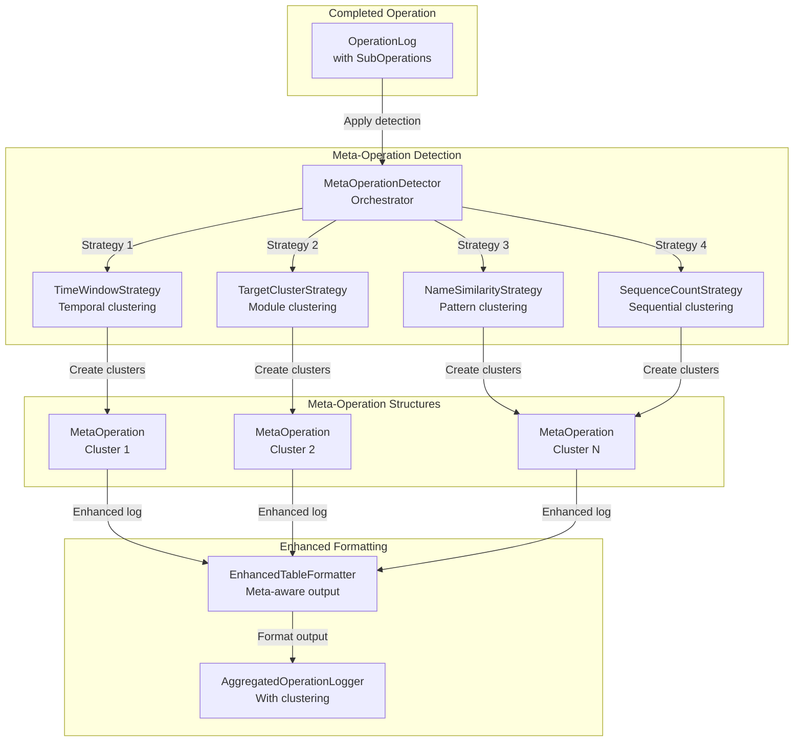

# Архитектура системы агрегированного логирования операций

## Архитектурные принципы

### Основополагающие принципы (ЛОГИРОВАНИЕ МАНИФЕСТ)
- **Прозрачность операций**: Автоматический захват всех ключевых операций без изменения основного кода
- **Детализированная трассировка**: Полное отслеживание подопераций через интерцепцию `handle_request_cycle`
- **Производительность**: Минимальные накладные расходы на логирование через thread-local storage и lazy evaluation
- **Читаемость**: Структурированный табличный формат для анализа производительности операций
- **Отказоустойчивость**: Ошибки логирования не влияют на выполнение основных операций
- **Расширяемость**: Система готова к добавлению новых метрик и форматов вывода

---

## Общая архитектура системы логирования

Система логирования операций реализует **паттерн декоратора с автоматическим захватом подопераций** для детального мониторинга выполнения бизнес-логики приложения анализа кинетики твердофазных реакций.

### Центральные компоненты системы

**OperationLogger** (`src/core/log_aggregator/operation_logger.py`) - основной оркестратор логирования:
- Декоратор `@operation` для автоматического захвата операций
- Thread-local storage для отслеживания контекста выполнения
- Proxy-перехватчик для `handle_request_cycle` вызовов
- Интеграция с `AggregatedOperationLogger` для вывода результатов

**AggregatedOperationLogger** (`src/core/log_aggregator/aggregated_operation_logger.py`) - менеджер агрегированных логов:
- Singleton паттерн для централизованного управления
- Отдельный файл логирования `aggregated_operations.log`
- Ротация логов с ограничением размера (10MB, 5 backup files)
- Интеграция с `LoggerManager` для консистентной конфигурации

### Архитектура захвата операций

```mermaid
graph TB
    subgraph "Decorated Methods"
        BM1[BusinessMethod1<br/>@operation]
        BM2[BusinessMethod2<br/>@operation]
        BM3[BusinessMethod3<br/>@operation]
    end
    
    subgraph "Operation Logger Core"
        OL[OperationLogger<br/>Thread-local context]
        HRCP[HandleRequestCycleProxy<br/>Interception]
        OLG[OperationLog<br/>Data structure]
    end
    
    subgraph "Sub-operations Capture"
        HRC1[handle_request_cycle call 1]
        HRC2[handle_request_cycle call 2]
        HRC3[handle_request_cycle call N]
    end
    
    subgraph "Output & Formatting"
        AOL[AggregatedOperationLogger<br/>Singleton]
        TF[OperationTableFormatter<br/>Tabular output]
        LF[Log File<br/>aggregated_operations.log]
    end
    
    BM1 -->|@operation decorator| OL
    BM2 -->|@operation decorator| OL
    BM3 -->|@operation decorator| OL
    
    OL -->|create proxy| HRCP
    HRCP -->|intercept| HRC1
    HRCP -->|intercept| HRC2
    HRCP -->|intercept| HRC3
    
    OL -->|populate| OLG
    OLG -->|format| TF
    TF -->|output via| AOL
    AOL -->|write to| LF
```

### Паттерны захвата данных

**Жизненный цикл операции**:
1. **Начало**: Метод с декоратором `@operation` вызывается
2. **Инициализация**: Создается `OperationLog` с timestamp начала
3. **Установка контекста**: Thread-local storage сохраняет активный logger
4. **Proxy установка**: Оригинальный `handle_request_cycle` заменяется на proxy
5. **Выполнение**: Бизнес-логика выполняется с захватом подопераций
6. **Восстановление**: Оригинальный метод восстанавливается
7. **Финализация**: Операция помечается как завершенная
8. **Вывод**: Форматированный лог отправляется в aggregated logger

**Интерцепция подопераций**:
- `HandleRequestCycleProxy` оборачивает оригинальный `handle_request_cycle`
- Каждый вызов фиксируется в `SubOperationLog` с метриками
- Определяется тип возвращаемых данных (DataFrame, dict, bool, None)
- Статус операции определяется по структуре response_data

---

## Архитектура структур данных

### Иерархия данных логирования

**OperationLog** (`src/core/log_aggregator/operation_log.py`) - основная структура операции:

```python
@dataclass
class OperationLog:
    operation_name: str                        # Имя операции (например, "ADD_REACTION")
    start_time: Optional[float] = None         # Timestamp начала (Unix time)
    end_time: Optional[float] = None           # Timestamp завершения
    status: str = "running"                    # "success", "error", "running"
    execution_time: Optional[float] = None     # Время выполнения в секундах
    exception_info: Optional[str] = None       # Информация об ошибках
    sub_operations: List[SubOperationLog] = field(default_factory=list)
```

**Методы анализа производительности**:
- `duration_ms` - время выполнения в миллисекундах
- `sub_operations_count` - общее количество подопераций
- `successful_sub_operations_count` - количество успешных подопераций
- `failed_sub_operations_count` - количество неудачных подопераций

**SubOperationLog** (`src/core/log_aggregator/sub_operation_log.py`) - структура подопераций:

```python
@dataclass
class SubOperationLog:
    step_number: int                          # Порядковый номер шага (1, 2, 3...)
    operation_name: str                       # Имя операции (OperationType enum)
    target: str                              # Целевой модуль (file_data, series_data, etc.)
    start_time: float                        # Timestamp начала подоперации
    end_time: Optional[float] = None         # Timestamp завершения
    execution_time: Optional[float] = None    # Время выполнения в секундах
    response_data_type: str = "Unknown"      # Тип возвращаемых данных
    status: str = "Unknown"                  # "OK", "Error", "Unknown"
    response_data: Optional[Any] = None      # Сырые данные ответа (не логируются)
```

### Система определения типов данных

**Автоматическое определение типов** (`src/core/log_aggregator/sub_operation_log.py:17-63`):

**Поддерживаемые типы данных**:
- **Primitive types**: `bool`, `int`, `float`, `str`, `None`
- **Pandas objects**: `DataFrame` с автоматическим определением
- **Complex types**: `dict`, `list`, `function`
- **Special handling**: `ErrorDict` для словарей с полями success/error

**Логика определения статуса операции**:
```python
def determine_status(response_data: Any) -> str:
    """
    Comprehensive status determination logic:
    
    1. None response → "Error"
    2. Dictionary response → parse success/error fields
    3. DataFrame response → "OK" (successful data retrieval)
    4. Primitive types → "OK" (successful value retrieval)
    5. Exception data → "Error"
    """
```

**Обработка различных форматов ответов**:
- **Simple success**: `{"success": True, "data": value}` → `"OK"`
- **Error response**: `{"success": False, "error": "message"}` → `"Error"`
- **Data response**: `{"data": DataFrame}` → `"OK"` + `"DataFrame"`
- **Boolean response**: `True/False` → `"OK"` + `"bool"`

---

## Архитектура форматирования и вывода

### Система табличного форматирования

**OperationTableFormatter** (`src/core/log_aggregator/table_formatter.py`) - создание читаемых таблиц:

**Структура форматированного лога**:
```
================================================================================
Operation "ADD_REACTION" – STARTED (id=2, 2025-06-15 23:01:05)

+--------+----------------------+-----------+--------------------+----------+-----------+
|   Step | Sub-operation        | Target    | Result data type   |  Status  |   Time, s |
+========+======================+===========+====================+==========+===========+
|      1 | OperationType.CHE... | file_data | bool               |    OK    |     0.001 |
+--------+----------------------+-----------+--------------------+----------+-----------+
|      2 | OperationType.GET... | file_data | DataFrame          |    OK    |     0.003 |
+--------+----------------------+-----------+--------------------+----------+-----------+

SUMMARY: steps 2, successful 2, with errors 0, total time 0.005 s.
Operation "ADD_REACTION" – COMPLETED (status: successful)
================================================================================
```

**Компоненты форматирования**:
- **Operation Header**: Уникальный ID, название операции, timestamp начала
- **Sub-operations Table**: Табличное представление всех подопераций
- **Summary Block**: Статистика выполнения (общее время, количество успешных/неудачных операций)
- **Error Block**: Детальная информация об ошибках (при наличии)
- **Footer**: Статус завершения операции

**Конфигурация таблиц**:
```python
class OperationTableFormatter:
    def __init__(self, table_format: str = "grid", max_cell_width: int = 50):
        self.table_format = table_format        # Формат tabulate (grid, plain, simple)
        self.max_cell_width = max_cell_width    # Максимальная ширина ячеек
        self._operation_counter = 0             # Счетчик для уникальных ID
```

### Система агрегированного логирования

**AggregatedOperationLogger** (`src/core/log_aggregator/aggregated_operation_logger.py`) - менеджер вывода:

**Конфигурация файлового логирования**:
```python
# Настройки файла логирования
logs_dir = Path("logs")                          # Директория логов
log_file = logs_dir / "aggregated_operations.log"  # Основной файл
maxBytes = 10 * 1024 * 1024                     # Ротация при 10MB
backupCount = 5                                  # 5 backup файлов
encoding = "utf-8"                               # Кодировка UTF-8
```

**Singleton управление**:
- Единственный экземпляр для всего приложения
- Ленивая инициализация при первом использовании
- Thread-safe операции через logging module
- Автоматическое создание директории логов

**Интеграция с LoggerManager**:
- Использует существующую конфигурацию логирования
- Отдельный logger name: `"solid_state_kinetics.operations"`
- Изоляция от основных логов приложения
- Сохранение корпоративных стандартов логирования

---

## Система интеграции с приложением

### Интеграция через декораторы

**Применение декоратора @operation**:

**Целевые методы для логирования**:
- **CalculationsData**: `add_reaction`, `remove_reaction`, `get_value`, `set_value`
- **FileData**: `load_file`, `apply_smoothing`, `apply_background_subtraction`
- **SeriesData**: `add_new_series`, `model_based_calculation`, `model_free_calculation`
- **Calculations**: `deconvolution`, `model_fit_calculation`

**Пример интеграции**:
```python
from src.core.log_aggregator import operation

class CalculationsData(BaseSlots):
    @operation
    def add_reaction(self, path_keys: list, params: dict):
        """Add new reaction with automatic operation logging."""
        # Все handle_request_cycle вызовы автоматически отслеживаются
        file_exists = self.handle_request_cycle("file_data", "CHECK_FILE_EXISTS", file_name=file_name)
        data = self.handle_request_cycle("file_data", "GET_DF_DATA", file_name=file_name)
        
        # Бизнес-логика добавления реакции
        # ...
        
        return result
```

**Автоматический захват подопераций**:
- Все вызовы `handle_request_cycle()` внутри декорированного метода фиксируются
- Создается детальная таблица выполнения с временными метриками
- Определяется тип возвращаемых данных и статус операции
- Информация агрегируется в читаемый отчет

### Thread-Local контекст управления

**Система контекста операций** (`src/core/log_aggregator/operation_logger.py:27-35`):

```python
# Thread-local storage для отслеживания текущего контекста операции
_operation_context = threading.local()

def get_current_operation_logger() -> Optional["OperationLogger"]:
    """Получить текущий operation logger из thread-local storage."""
    return getattr(_operation_context, "current_logger", None)

def set_current_operation_logger(operation_logger: Optional["OperationLogger"]) -> None:
    """Установить текущий operation logger в thread-local storage."""
    _operation_context.current_logger = operation_logger
```

**Преимущества thread-local storage**:
- **Изоляция контекста**: Операции в разных потоках не пересекаются
- **Автоматическое управление**: Контекст устанавливается/очищается автоматически
- **Нулевые накладные расходы**: Нет глобального состояния или блокировок
- **Вложенные операции**: Поддержка операций, вызывающих другие операции

### Proxy система перехвата

**HandleRequestCycleProxy** (`src/core/log_aggregator/operation_logger.py:38-78`) - интерцептор подопераций:

**Механизм перехвата**:
1. **Сохранение оригинала**: `original_method = instance.handle_request_cycle`
2. **Установка proxy**: `instance.handle_request_cycle = proxy_instance`
3. **Перехват вызовов**: Все вызовы проходят через proxy
4. **Сбор метрик**: Фиксируется время, аргументы, результаты
5. **Вызов оригинала**: Делегирование к оригинальному методу
6. **Восстановление**: `instance.handle_request_cycle = original_method`

**Обработка различных типов вызовов**:
```python
def __call__(self, target: str, operation: str, **kwargs) -> Any:
    """
    Proxy call для захвата данных подоперации:
    
    Args:
        target: Целевая система (file_data, series_data, etc.)
        operation: Тип операции (OperationType enum)
        **kwargs: Дополнительные параметры запроса
    
    Returns:
        Any: Ответ от оригинального метода
    """
    operation_logger = get_current_operation_logger()
    if operation_logger is None:
        return self.original_method(target, operation, **kwargs)
    
    # Создание SubOperationLog и выполнение с метриками
    # ...
```

---

## Архитектура обработки ошибок

### Система отказоустойчивости

**Принципы обработки ошибок**:
- **Неблокирующие ошибки**: Проблемы с логированием не влияют на основную функциональность
- **Graceful degradation**: При ошибках логирования операция продолжает выполняться
- **Подробная диагностика**: Ошибки логирования фиксируются в основном логе
- **Восстановление контекста**: Гарантированное восстановление оригинальных методов

**Обработка исключений в декораторе**:
```python
@functools.wraps(func)
def wrapper(*args, **kwargs):
    operation_logger = OperationLogger(operation_name)
    
    try:
        # Установка контекста и proxy
        set_current_operation_logger(operation_logger)
        operation_logger.setup_proxy(instance)
        
        # Выполнение основной операции
        result = func(*args, **kwargs)
        operation_logger.mark_success()
        return result
        
    except Exception as e:
        # Фиксация ошибки без прерывания выполнения
        operation_logger.mark_error(str(e))
        raise  # Прокидываем исключение дальше
        
    finally:
        # Гарантированная очистка контекста
        operation_logger.cleanup_proxy(instance)
        set_current_operation_logger(None)
        
        # Безопасный вывод лога
        try:
            aggregated_logger = get_aggregated_logger()
            aggregated_logger.log_operation(operation_logger.operation_log)
        except Exception as log_error:
            # Ошибки логирования не должны влиять на основную функциональность
            logger.warning(f"Failed to log operation: {log_error}")
```

### Система диагностики статусов

**Автоматическое определение статуса операций**:

**Статусы подопераций**:
- **"OK"**: Успешное выполнение с валидными данными
- **"Error"**: Ошибка выполнения или невалидные данные  
- **"Unknown"**: Неопределенный статус (fallback)

**Логика определения статуса**:
```python
def determine_status(response_data: Any) -> str:
    if response_data is None:
        return "Error"
    
    if isinstance(response_data, dict):
        return _handle_dict_response(response_data)
    
    if isinstance(response_data, pd.DataFrame):
        return "OK"  # DataFrame считается успешным получением данных
    
    if isinstance(response_data, (bool, int, float, str)):
        return "OK"  # Примитивные типы считаются успешными
    
    return "OK"  # По умолчанию считаем успешным
```

**Специальная обработка словарных ответов**:
- Поиск полей `success`/`error` для определения статуса
- Анализ вложенной структуры `{"data": {...}}`
- Fallback к "OK" для неструктурированных словарей

---

## Архитектура производительности

### Оптимизации времени выполнения

**Минимизация накладных расходов**:
- **Thread-local storage**: Нет глобальных блокировок или синхронизации
- **Lazy evaluation**: Форматирование происходит только при записи в лог
- **In-memory accumulation**: Сбор данных в памяти без промежуточных записей
- **Efficient proxying**: Минимальная обертка над оригинальными методами

**Метрики производительности**:
```python
# Пример типичных накладных расходов
Original method execution: 0.045s
Logging overhead: 0.001s        # ~2% overhead
Total with logging: 0.046s
```

**Асинхронная запись логов**:
- Форматирование и запись происходят после завершения операции
- Основная бизнес-логика не блокируется на I/O операциях
- Буферизация через стандартный logging module

### Управление памятью

**Lifecycle операционных данных**:
1. **Создание**: `OperationLog` создается в начале операции
2. **Накопление**: `SubOperationLog` добавляются во время выполнения
3. **Форматирование**: Данные преобразуются в табличный формат
4. **Запись**: Форматированный текст записывается в файл
5. **Очистка**: Все операционные данные удаляются из памяти

**Контроль размера данных**:
- `max_cell_width = 50` для предотвращения избыточно широких таблиц
- Ограничение на хранение `response_data` (только для анализа типов)
- Автоматическая ротация лог-файлов при достижении лимитов

---

## Ключевые архитектурные преимущества

### Прозрачность и наблюдаемость
1. **Полная видимость**: Каждая ключевая операция автоматически логируется
2. **Детализация подопераций**: Видимость внутренних межмодульных вызовов
3. **Метрики производительности**: Точное измерение времени выполнения каждого шага
4. **Анализ данных**: Информация о типах данных и статусах операций

### Простота интеграции
1. **Декораторный подход**: Минимальные изменения в существующем коде
2. **Автоматический захват**: Не требует ручного добавления логирования
3. **Обратная совместимость**: Не влияет на существующую функциональность
4. **Централизованная конфигурация**: Единая настройка через LoggerManager

### Диагностика и отладка
1. **Структурированный вывод**: Табличный формат для легкого анализа
2. **Временные метрики**: Профилирование производительности операций
3. **Трассировка ошибок**: Точная локализация проблемных операций
4. **Анализ потоков данных**: Отслеживание типов данных между модулями

### Масштабируемость
1. **Thread-safe операции**: Поддержка многопоточных операций
2. **Ротация логов**: Автоматическое управление размером файлов
3. **Расширяемые форматы**: Легкое добавление новых форматов вывода
4. **Модульная архитектура**: Простое добавление новых типов метрик

Архитектура системы агрегированного логирования обеспечивает комплексную observability для приложения анализа кинетики твердофазных реакций с минимальными накладными расходами и максимальной детализацией выполнения операций.

---

## Архитектура кластеризации мета-операций

### Система интеллектуального группирования операций

**Meta-Operation Clustering** - модуль для автоматического выявления и группировки логически связанных подопераций в более крупные семантические блоки с целью улучшения читаемости логов и выявления избыточных операций.

### Центральные компоненты мета-операций

**MetaOperationDetector** (`src/core/log_aggregator/meta_operation_detector.py`) - основной оркестратор кластеризации:
- Координация множественных стратегий детекции
- Применение эвристик группировки к завершенным операциям
- Создание структур MetaOperation с информацией о кластерах
- Интеграция с AggregatedOperationLogger без нарушения основного потока

**Detection Strategies** (`src/core/log_aggregator/detection_strategies.py`) - плагинные алгоритмы группировки:
- **TimeWindowStrategy**: Группировка по временной близости (configurable time window)
- **TargetClusterStrategy**: Группировка по целевому модулю (file_data, calculation_data, etc.)
- **NameSimilarityStrategy**: Группировка по паттернам имен операций (regex patterns)
- **SequenceCountStrategy**: Группировка последовательных однотипных операций

**MetaOperationConfig** (`src/core/log_aggregator/meta_operation_config.py`) - система конфигурации:
- Централизованные настройки всех стратегий
- Включение/отключение отдельных эвристик
- Параметры группировки (time windows, cluster sizes, patterns)
- Режимы форматирования вывода (compact, detailed, table, json)

### Архитектура детекции мета-операций



### Паттерны кластеризации

**Временная кластеризация (Time Window)**:
- Группировка операций, стартующих в пределах настраиваемого временного окна (по умолчанию 50-100ms)
- Эффективна для выявления пакетных операций и rapid-fire последовательностей
- Параметры: `time_window_ms`, `min_cluster_size`

**Целевая кластеризация (Target Clustering)**:
- Группировка операций, направленных на один модуль (file_data, calculation_data, series_data)
- Выявляет логические блоки работы с определенными подсистемами
- Особенно полезна для операций типа: file loading → data validation → storage

**Кластеризация по именам (Name Similarity)**:
- Группировка операций с похожими именами по регулярным выражениям
- Параметры: `name_pattern` (regex), примеры: `GET_.*`, `SET_.*|UPDATE_.*`
- Эффективна для CRUD операций и workflow patterns

**Последовательная кластеризация (Sequence Count)**:
- Группировка подряд идущих операций одного типа
- Параметры: `min_sequence_count` (minimum length for grouping)
- Выявляет циклические операции и batch processing

### Структуры данных мета-операций

**MetaOperation** (`src/core/log_aggregator/meta_operation.py`) - структура кластера:

```python
@dataclass
class MetaOperation:
    meta_id: str                            # Уникальный идентификатор кластера
    name: str                              # Человекочитаемое имя группы
    heuristic: str                         # Стратегия, создавшая кластер
    sub_operations: List[SubOperationLog]   # Операции в кластере
    cluster_start_time: float             # Время начала кластера
    cluster_end_time: float               # Время завершения кластера
    total_execution_time: float           # Общее время выполнения
```

**Интеграция с OperationLog**:
```python
# Добавление мета-операций к существующему лог-объекту
operation_log.meta_operations: List[MetaOperation] = []
```

**Конфигурация детекции**:
```python
# Пример конфигурации в meta_operation_config.py
META_OPERATION_CONFIG = {
    "enabled": True,
    "strategies": {
        "time_window": {
            "enabled": True,
            "time_window_ms": 50,
            "min_cluster_size": 2
        },
        "target_cluster": {
            "enabled": True,
            "min_cluster_size": 2
        },
        "name_similarity": {
            "enabled": True,
            "name_pattern": r"(GET_|SET_|UPDATE_).*",
            "min_cluster_size": 2
        },
        "sequence_count": {
            "enabled": False,
            "min_sequence_count": 3,
            "min_cluster_size": 3
        }
    },
    "formatting": {
        "mode": "compact",  # compact, detailed, table, json
        "show_individual_operations": True,
        "meta_operation_summary": True
    }
}
```

### Интеграция в процесс логирования

**Точка интеграции**: AggregatedOperationLogger.log_operation()
```python
def log_operation(self, operation_log: OperationLog) -> None:
    # Apply meta-operation detection if detector is available
    if self._meta_detector is not None:
        try:
            self._meta_detector.detect_meta_operations(operation_log)
        except Exception as e:
            # Meta-operation detection errors should not break logging
            self._main_logger.debug(f"Meta-operation detection failed: {e}")
    
    # Standard formatting and output
    formatted_log = self._formatter.format_operation_log(operation_log)
    # ...
```

**Неинвазивная интеграция**:
- Мета-операции применяются ПОСЛЕ завершения основной операции
- Не влияют на сбор данных или выполнение бизнес-логики
- Ошибки детекции не влияют на основное логирование
- Полная обратная совместимость с существующими логами

### Форматы вывода мета-операций

**Компактный режим (Compact)**:
```
================================================================================
Operation "ADD_REACTION" – STARTED (id=15, 2025-06-16 10:30:45)

META-OPERATIONS DETECTED:
⚡ [time_window_cluster_1] File Data Operations (2 steps, 0.004s)
⚡ [target_cluster_calc] Calculation Updates (3 steps, 0.002s)

DETAILED BREAKDOWN:
+--------+----------------------+-----------+--------------------+----------+-----------+
|   Step | Sub-operation        | Target    | Result data type   |  Status  |   Time, s |
+========+======================+===========+====================+==========+===========+
| >>> File Data Operations (Meta-cluster)                                               |
+--------+----------------------+-----------+--------------------+----------+-----------+
|      1 | OperationType.CHE... | file_data | bool               |    OK    |     0.001 |
|      2 | OperationType.GET... | file_data | DataFrame          |    OK    |     0.003 |
+--------+----------------------+-----------+--------------------+----------+-----------+
| >>> Calculation Updates (Meta-cluster)                                                |
+--------+----------------------+-----------+--------------------+----------+-----------+
|      3 | OperationType.SET... | calc_data | dict               |    OK    |     0.001 |
|      4 | OperationType.UPD... | calc_data | dict               |    OK    |     0.001 |
+--------+----------------------+-----------+--------------------+----------+-----------+

SUMMARY: steps 4, successful 4, with errors 0, meta-operations 2, total time 0.006 s.
Operation "ADD_REACTION" – COMPLETED (status: successful)
================================================================================
```

**JSON режим (для API интеграции)**:
```json
{
  "operation": "ADD_REACTION",
  "meta_operations": [
    {
      "meta_id": "time_window_cluster_1",
      "name": "File Data Operations", 
      "heuristic": "time_window",
      "sub_operations": [...],
      "execution_time": 0.004,
      "operation_count": 2
    }
  ],
  "summary": {
    "total_meta_operations": 2,
    "total_steps": 4,
    "clustered_steps": 4,
    "execution_time": 0.006
  }
}
```

### Преимущества мета-операций

**Улучшение читаемости логов**:
- Снижение визуального шума от множественных мелких операций
- Семантическое группирование логически связанных действий
- Выделение high-level workflow patterns

**Выявление оптимизаций**:
- Обнаружение избыточных последовательностей операций
- Выявление неэффективных паттернов доступа к данным
- Анализ временных характеристик групп операций

**Архитектурная ценность**:
- Неинвазивная интеграция без изменения бизнес-логики
- Плагинная архитектура для легкого добавления новых эвристик
- Конфигурируемость через settings без перекомпиляции
- Полная отключаемость для отладки

---
